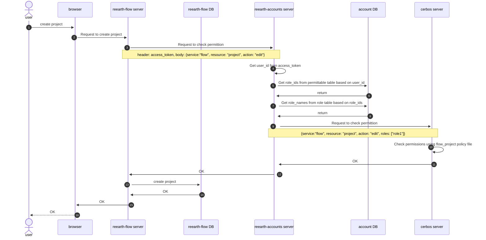

# Permission check (when create project with flow)

```mermaid
sequenceDiagram
autonumber

actor user
participant browser
participant flowServer as reearth-flow server
participant flowDB as reearth-flow DB
participant accountsServer as reearth-accounts server
participant accountDB as account DB
participant cerbos as cerbos server

user ->>+ browser :create project
browser ->>+ flowServer :Request to create project
flowServer ->>+ accountsServer :Request to check permittion
note over flowServer, accountsServer: header: access_token, body: {service:"flow", resource: "project", action: "edit"}
accountsServer ->>+ accountsServer :Get user_id from access_token
accountsServer ->>+ accountDB :Get role_ids from permittable table based on user_id
accountDB ->>+ accountsServer :return
accountsServer ->>+ accountDB :Get role_names from role table based on role_ids
accountDB ->>+ accountsServer :return
accountsServer ->>+ cerbos :Request to check permittion
note over accountsServer, cerbos: {service:"flow", resource: "project", action: "edit", roles: ["role1"]}
cerbos ->>+ cerbos :Check permissions using flow_project policy file
cerbos ->>+ accountsServer :OK
accountsServer ->>+ flowServer :OK
flowServer ->>+ flowDB: create project
flowDB ->>+ flowServer :OK
flowServer ->>+ browser :OK
browser -->>+ user: OK
```
