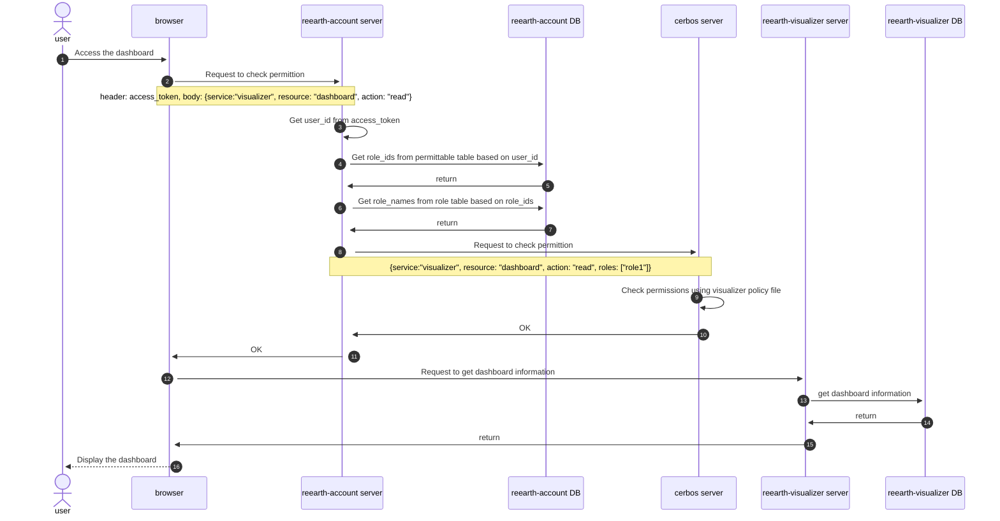

# Permission check (when accessing dashboard with visualizer)

```mermaid
sequenceDiagram
autonumber

actor user
participant browser
participant accountServer as reearth-account server
participant accountDB as reearth-account DB
participant cerbos as cerbos server
participant visualizerServer as reearth-visualizer server
participant visualizerDB as reearth-visualizer DB

user ->>+ browser :Access the dashboard
browser ->>+ accountServer :Request to check permittion
note over browser, accountServer: header: access_token, body: {service:"visualizer", resource: "dashboard", action: "read"}
accountServer ->>+ accountServer :Get user_id from access_token
accountServer ->>+ accountDB :Get role_ids from permittable table based on user_id
accountDB ->>+ accountServer :return
accountServer ->>+ accountDB :Get role_names from role table based on role_ids
accountDB ->>+ accountServer :return
accountServer ->>+ cerbos :Request to check permittion
note over accountServer, cerbos: {service:"visualizer", resource: "dashboard", action: "read", roles: ["role1"]}
cerbos ->>+ cerbos :Check permissions using visualizer policy file
cerbos ->>+ accountServer :OK
accountServer ->>+ browser :OK
browser ->>+ visualizerServer: Request to get dashboard information
visualizerServer ->>+ visualizerDB: get dashboard information
visualizerDB ->>+ visualizerServer :return
visualizerServer ->>+ browser :return
browser -->>+ user: Display the dashboard
```
