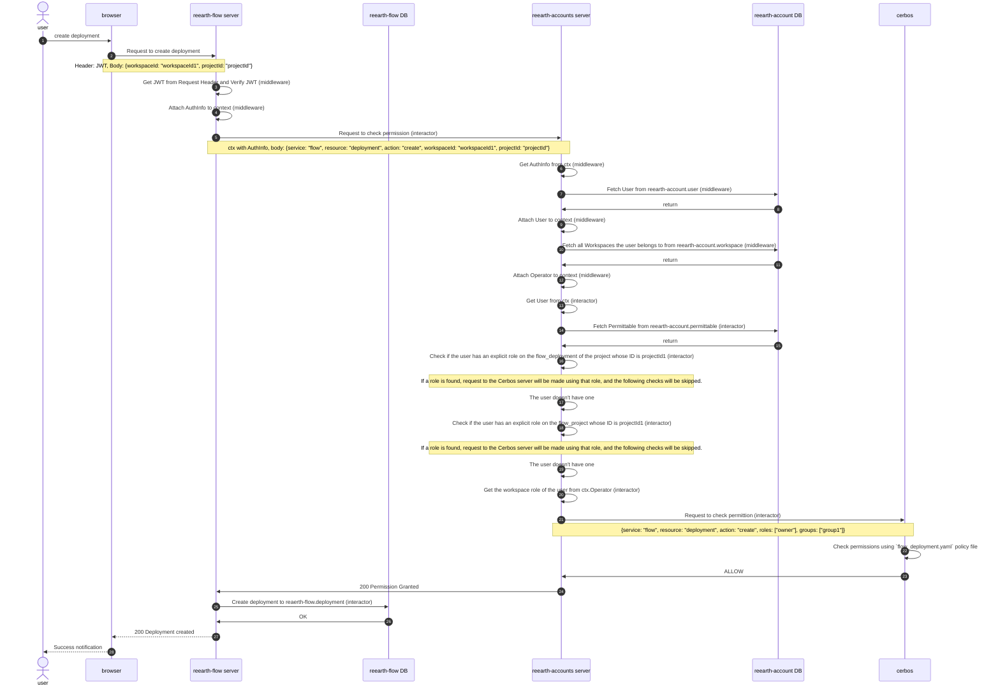

# Permission Check Flow (When Creating a Deployment in reearth-flow)
## When the user doesn't have an explicit role for either the `flow_deployment` or the `flow_project`

```mermaid
sequenceDiagram
autonumber

actor user
participant browser
participant flowServer as reearth-flow server
participant flowDB as reearth-flow DB
participant accountsServer as reearth-accounts server
participant accountDB as reearth-account DB

user ->> browser: create deployment
browser ->> flowServer: Request to create deployment
note over browser, flowServer: Header: JWT, Body: {workspaceId: "workspaceId1", projectId: "projectId"}

flowServer ->> flowServer: Get JWT from Request Header and Verify JWT (middleware)
flowServer ->> flowServer: Attach AuthInfo to context (middleware)

flowServer ->> accountsServer: Request to check permission (interactor)
note over flowServer, accountsServer: ctx with AuthInfo, body: {service: "flow", resource: "deployment", action: "create", workspaceId: "workspaceId1", projectId: "projectId"}

accountsServer ->> accountsServer: Get AuthInfo from ctx (middleware)
accountsServer ->> accountDB: Fetch User from reearth-account.user (middleware)
accountDB ->> accountsServer: return
accountsServer ->> accountsServer: Attach User to context (middleware)
accountsServer ->> accountDB: Fetch all Workspaces the user belongs to from reearth-account.workspace (middleware)
accountDB ->> accountsServer: return
accountsServer ->> accountsServer: Attach Operator to context (middleware)

accountsServer ->> accountsServer: Get User from ctx (interactor)
accountsServer ->> accountDB: Fetch Permittable from reearth-account.permittable (interactor)
accountDB ->> accountsServer: return

accountsServer ->> accountsServer: Check if the user has an explicit role on the flow_deployment of the project whose ID is projectId1 (interactor)
note over accountsServer: If a role is found, request to the Cerbos server will be made using that role, and the following checks will be skipped.
accountsServer ->> accountsServer: The user doesn't have one

accountsServer ->> accountsServer: Check if the user has an explicit role on the flow_project whose ID is projectId1 (interactor)
note over accountsServer: If a role is found, request to the Cerbos server will be made using that role, and the following checks will be skipped.
accountsServer ->> accountsServer: The user doesn't have one

accountsServer ->> accountsServer: Get the workspace role of the user from ctx.Operator (interactor)
accountsServer ->> cerbos :Request to check permittion (interactor)
note over accountsServer, cerbos: {service: "flow", resource: "deployment", action: "create", roles: ["owner"], groups: ["group1"]}
cerbos ->> cerbos :Check permissions using `flow_deployment.yaml` policy file
cerbos ->> accountsServer :ALLOW
accountsServer ->> flowServer :200 Permission Granted

flowServer ->> flowDB: Create deployment to reaerth-flow.deployment (interactor)
flowDB ->> flowServer :OK
flowServer -->> browser: 200 Deployment created
browser -->> user: Success notification
```
