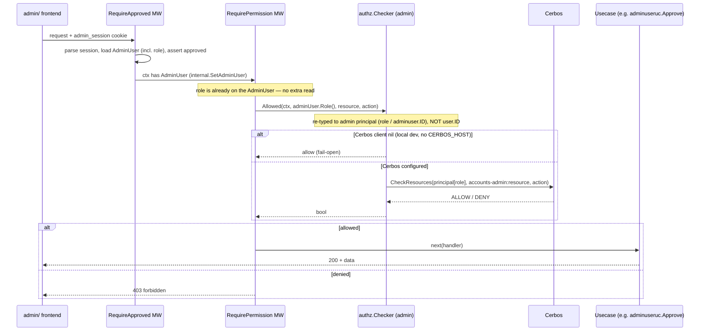

# Admin Role (Granular Admin Permissions)

> **Status: DRAFT for review** (reearth-dashboard#1316). An admin has **exactly
> one `role`** enum (`system_admin` | `viewer`) stored **directly on the
> `adminuser.AdminUser` aggregate** (additive Mongo/Postgres migration; no new
> collection/table/aggregate). Enforcement is **Cerbos-based**: a
> `RequirePermission` middleware (layered on `RequireApproved`) reads the
> already-loaded role and calls the admin `authz.Checker` → Cerbos
> `CheckResources` against the `accounts-admin` policy. One open launch
> dependency remains: runtime policy distribution (see Open Questions).

## Document Signature

|           |                                                        |
|-----------|--------------------------------------------------------|
| Creator   | [author]                                               |
| Leader    | [pending]                                              |
| Task Link | reearth-dashboard#1316 (part of epic reearth-dashboard#1233) |
| Developer | [pending]                                              |

## Background / Problem Statement

The admin application (`server/internal/admin/`) currently treats **every
approved admin as equal**. The only gate is `RequireApproved`
(`internal/admin/presentation/middleware/require_approved.go`): once an
`adminuser.AdminUser` has `status == approved`, it can call every admin endpoint
(list/read users, workspaces, members; approve/reject/revoke *other* admins).
This was a deliberate V1 non-goal of the ADMIN-AUTH epic (reearth-dashboard#1233);
#1316 is the follow-up. Problems:

1. **No least-privilege.** A read-only operator is indistinguishable from a
   super-admin; all approved-admin routes sit under one `requireApproved`
   middleware in `router.go` with no per-action check.
2. **Approve/reject of admins is high-privilege** yet available to any approved
   admin; granting/revoking admin access should itself be restricted.
3. **The enforcement machinery already exists but is dormant.** The admin Cerbos
   `Checker` (`internal/admin/usecase/authz/checker.go`), the RBAC definitions
   (`internal/admin/rbac/definitions.go`, service `accounts-admin`, single role
   `admin`), and the Cerbos client provider (`provideCerbosClient`,
   `//nolint:unused` "for reearth-dashboard#1316") are wired but unused. The
   selected design **consumes** this machinery.

### Two ID spaces

There are two separate authorization worlds and #1316 must not conflate them:
end-users (`pkg/user`, `user.ID`, service `accounts`) vs. admins (`pkg/adminuser`,
`adminuser.ID`, service `accounts-admin`). `pkg/permittable` binds `user.ID` →
roles for the `accounts` service; admins live in a different ID space. The
selected design sidesteps this entirely by storing the role on the
`adminuser.AdminUser` aggregate itself — no `permittable`-style lookup.

|  | End-user (`accounts`) | Admin (`accounts-admin`) |
|---|---|---|
| Identity | `user.ID` | `adminuser.ID` |
| Roles today | Owner/Maintainer/Writer/Reader/Self | single `"admin"` |

This surfaces a latent, in-scope bug: today `authz.Checker.Allowed(ctx, caller
user.ID, …)` takes a `user.ID`, but the admin principal is an `adminuser.ID`. It
must be **re-typed to take the admin principal** (the already-loaded `role` /
`adminuser.ID`), with the DI provider-set signature in `internal/admin/di`
updated accordingly.

## Goals

1. Approved admins are no longer all-equal: each endpoint's access is decided by
   the caller's single admin **role**, checked via Cerbos (`accounts-admin`
   policy) by `RequirePermission` layered on `RequireApproved`.
2. Define a first-class super-admin role plus a lower-privilege role, with a
   default that locks nobody out on rollout.
3. Store the role on the `adminuser.AdminUser` aggregate (a `role` enum field),
   including how it is granted at/after approval and how bootstrap admins obtain
   the highest role.
4. Keep the `accounts-admin` role→action matrix (`internal/admin/rbac`) as the
   single source of truth, compiled into the Cerbos policy via `cmd/policy-generator`.
5. Enforce **additively** — no path/response changes; only new `403` outcomes.
6. Rollout is safe: migration backfills existing approved admins to super-admin,
   enabled fail-open → fail-closed so nobody is locked out mid-deploy.

## Non-Goals

1. **Admin UI for managing roles** — a separate frontend follow-up.
2. **Changing end-user (`accounts`) authorization** — untouched.
3. **A general audit-log** for role changes beyond existing
   `approvedBy`/`approvedAt` (role changes SHOULD still be logged — see Post
   Deployment).
4. **Per-resource-instance rules** — V1 is per-action/per-resource-type.
5. **Removing the Cerbos wiring** — #1316 keeps and reuses it.

## Functional Requirements

1. Every approved-admin route maps to a `(resource, action)` pair on the
   `accounts-admin` matrix, checked before the usecase runs.
2. **Zero extra datastore reads** per request: the role is already on the
   `AdminUser` in the echo context; the checker adds exactly **one Cerbos
   `CheckResources` gRPC call** per protected request.
3. Latency budget: < ~15 ms p95 added. Admin traffic is very low volume.
4. Local dev unaffected: with `CERBOS_HOST` empty, a nil Cerbos client **fails
   open** (allow), as it already does today.
5. Bootstrap admins (`REEARTH_ACCOUNTS_ADMIN_BOOTSTRAP_EMAILS`) always resolve to
   super-admin, even on a brand-new database.
6. Backward compatible: existing approved admins retain full access post-migration
   (role backfilled to super-admin).

## Solution Options

Seven design questions. The core storage and enforcement decisions are final;
the rest have a single recommended approach.

### Q1 — Role model

**DECIDED: two role types for V1**, a small fixed enum modelled on the existing
`adminuser.Status` enum.

| Role (enum value) | Holders | Capabilities |
|---|---|---|
| `system_admin` | Platform operators, bootstrap admins | Everything: manage admins (approve/reject/revoke), assign roles, read + (future) mutate all resources |
| `viewer` | Support / read-only staff | List/read users, workspaces, members, admin-users. No approve/reject, no mutations, no role assignment |

The existing single Cerbos role `"admin"` is **renamed** to `system_admin`. A
fixed enum keeps the matrix a compile-time constant. A third role (e.g.
`user_admin`) is easy to add later and is deferred (Open Questions).

### Q2 — Where the role lives (SELECTED: field on the aggregate)

**Selected: a single `role` enum field directly on the `adminuser.AdminUser`
aggregate, plus an additive Mongo/Postgres migration. No new collection, table,
or aggregate.** An admin has exactly one role.

The enum mirrors the existing `adminuser.Status` pattern in
`server/pkg/adminuser/enum.go` (`type Role string`, valid-values slice,
`Valid()`, `RoleFrom(string)`), with a getter, a `SetRole` mutator, and a builder
method on the aggregate — this is already implemented in PR #282. The
`adminuser` repos (`mongo`/`postgres`/`memory`) gain the field in their mappings;
`adminUserRepo.Save` persists it.

Why: minimal change (one field + accessors + one additive migration); no ID-space
confusion (role lives in the admin's own ID space); simplifies the Cerbos check
because `RequireApproved` already loads the role; single-role is sufficient for
V1 (the two roles are mutually exclusive privilege tiers).

**Trade-off:** exactly one role per admin. If multi-role is ever needed, migrate
to the deferred alternative below.

**Deferred alternative (multi-role).** A new binding aggregate
`pkg/adminpermittable` (name TBD) binding `adminuser.ID` → `[]role.ID`, reusing
`pkg/role`, with its own collection/table across three backends and a seeding
migration; the checker would take an `adminuser.ID` + a `FindByAdminUserID` repo.
Its only distinguishing advantage — multiple roles per admin — is not needed for
V1, so it is deferred, not deleted. (A sub-alternative — reusing the *existing*
`pkg/permittable` by casting `adminuser.ID` into `user.ID` — is rejected outright:
it collides two distinct ULID ID spaces in one `user.ID`-indexed collection that
end-user authz also reads.)

### Q3 — Enforcement (SELECTED: Cerbos)

A per-route/group **permission middleware** maps the matched route to a
`(resource, action)` pair and checks before the handler, keeping the check
declarative and colocated with `router.go`. The admin user is already in the echo
context (`internal.GetAdminUser(c)`).

`RequirePermission` reads the caller's role from the loaded `AdminUser` and hands
it to the admin `authz.Checker`, which does a Cerbos `CheckResources` against the
`accounts-admin` policy for the route's `(resource, action)`. The checker is
re-typed to take the admin principal (role / `adminuser.ID`), not `user.ID`, and
needs no `permittable` lookup.

```go
// presentation/middleware/require_permission.go (SELECTED: Cerbos)
func RequirePermission(chk *authz.Checker, resource, action string) echo.MiddlewareFunc {
    return func(next echo.HandlerFunc) echo.HandlerFunc {
        return func(c echo.Context) error {
            u, err := internal.GetAdminUser(c) // set by RequireApproved; role loaded
            if err != nil {
                return echo.NewHTTPError(http.StatusUnauthorized)
            }
            ok, err := chk.Allowed(c.Request().Context(), u.Role(), resource, action)
            if err != nil {
                return echo.NewHTTPError(http.StatusInternalServerError)
            }
            if !ok {
                return echo.NewHTTPError(http.StatusForbidden, "forbidden")
            }
            return next(c)
        }
    }
}
```

**Why Cerbos:** consistency with the end-user `accounts` authorization model
(`internal/usecase/interactor/cerbos.go`), consuming the existing dormant
machinery rather than adding a second enforcement style, and fail-open in local
dev is already handled.

**Rejected for V1 — in-process static check.** `RequirePermission` could instead
check the role against the static matrix in-process (`rbac.Allowed(role,
resource, action)`), with no Cerbos call, no extra latency, and it would sidestep
the checker's typing bug. It was rejected to avoid running two divergent
enforcement mechanisms; it remains available if the Cerbos policy-distribution
dependency (Q4) ever proves prohibitive.

**Endpoint → resource/action mapping** (existing routes + near-future
mutations). This drives the `accounts-admin` Cerbos policy:

| Method / Path | Resource | Action | Min role |
|---|---|---|---|
| `GET /api/v1/admin-users` | `admin_user` | `list` | viewer |
| `POST /api/v1/admin-users/:id/approve` | `admin_user` | `approve` | system_admin |
| `POST /api/v1/admin-users/:id/reject` | `admin_user` | `reject` | system_admin |
| `GET /api/v1/users` | `user` | `list` | viewer |
| `GET /api/v1/users/:id` | `user` | `read` | viewer |
| `GET /api/v1/users/:id/workspaces` | `user` | `read` | viewer |
| `GET /api/v1/workspaces` | `workspace` | `list` | viewer |
| `GET /api/v1/workspaces/:id` | `workspace` | `read` | viewer |
| `GET /api/v1/workspaces/:id/members` | `workspace` | `read_member` | viewer |
| *(future)* `PATCH/DELETE users/workspaces` | resp. | `edit` / `delete` | system_admin |
| `PUT /api/v1/admin-users/:id/roles` (see Q5) | `admin_user` | `assign_role` | system_admin |

Notes:
- `/api/v1/me` and `/api/v1/auth/*` stay public / session-only (no permission
  check) — they are the pending/rejected screens' lifeline and must work for any
  status.
- `approve`/`reject` are **new actions** not in today's `resourceRules` (which has
  only `list/read/edit/delete`). Making them distinct actions is what lets a
  viewer read the admin-user list while only system_admin can act on it.
- A new resource `admin_user` is added (distinct from `user`, which refers to the
  end-users the admin inspects).
- "Min role" is enforced via Cerbos against the compiled `accounts-admin` policy.

### Q4 — Role→action matrix and the `accounts-admin` policy (REQUIRED for V1)

`internal/admin/rbac/definitions.go` evolves from single- to multi-role by adding
role-name constants, the `admin_user` resource, the `approve`/`reject`/`assign_role`
actions, and listing multiple roles per action. `resourceRules` remains the single
source of truth and is compiled into the `accounts-admin` Cerbos policy.

| Resource | Action | Roles |
|---|---|---|
| `admin_user` | `list` | system_admin, viewer |
| `admin_user` | `approve` / `reject` / `assign_role` | system_admin |
| `user` | `list` / `read` | system_admin, viewer |
| `user` | `edit` / `delete` | system_admin |
| `workspace` | `list` / `read` / `read_member` | system_admin, viewer |
| `workspace` | `edit` / `delete` | system_admin |

`DefineResources` needs no structural change — it already iterates actions→roles
generically; only the data grows. Policies are generated by
`server/cmd/policy-generator/main.go` (one entry per service: `accounts` and
`accounts-admin`), invoked via `make gen-policies`. The V1 deliverable:
regenerate the `accounts-admin` policy and land the updated YAML.

> **⚠ Dependency / Risk (launch blocker) — runtime policy distribution.**
> Policies are generated locally into the **gitignored** `server/policies/`
> directory (`PolicyFileDir = "policies"` relative to `server/`; `/policies` is in
> `server/.gitignore`). **Nothing is checked in** — there is no `policies/`
> directory at the repo root and no policy YAML committed anywhere. **The
> mechanism by which the generated `accounts-admin` YAML reaches the running
> Cerbos instance is unknown.** CLAUDE.md mentions a GCS sync via GitHub Actions,
> but **no such workflow exists** under `.github/workflows/`. Because enforcement
> is Cerbos-based, the policy MUST reach the running Cerbos instance or protected
> endpoints will fail. **This must be confirmed with the platform/Cerbos owner
> before rollout** — it is the single remaining open dependency (see Open
> Questions).

### Q5 — Role assignment flow

**Who:** system_admin only (`admin_user:assign_role`, enforced by the same
middleware/matrix).

**How:** the assignment mutates the `role` field on the target `AdminUser` (via
`SetRole`) and persists with `adminUserRepo.Save`. No separate binding.

1. **On approval.** When a system_admin approves a pending admin, the new admin's
   role is set to the **default `viewer`** (least-privilege by default). Bootstrap
   admins are the exception (Q6).
2. **Explicit change:**

   | Method / Path | Auth | Description |
   |---|---|---|
   | `PUT /api/v1/admin-users/:id/roles` | system_admin | Set the target's single role. Body: `{ "role": "viewer" }`. Loads the target, `SetRole`, `Save`. |

**Guards:** an admin cannot demote their **own last** `system_admin`, and the
system must never reach **zero** `system_admin`s (count `role == system_admin`
before persisting a demotion) — analogous to the existing "last approved admin
cannot be rejected" rule. Path stays plural `/roles` for URL stability though the
body carries a single role. UI is a non-goal; the endpoint + guards suffice for
V1 (drive via API/script until the UI lands).

### Q6 — Bootstrap

Bootstrap admins (`REEARTH_ACCOUNTS_ADMIN_BOOTSTRAP_EMAILS`, already auto-approved
at sign-in in `authuc`) must receive **`system_admin`**, otherwise on a fresh DB
nobody could ever gain it. At the sign-in upsert, also ensure `role =
system_admin` (idempotent: set on create; elevate an existing record but **never
downgrade** an already-`system_admin`). Because it is keyed off config, re-adding
an email to the env var re-grants `system_admin` if lost — a deliberate recovery
safety valve, avoiding the chicken-and-egg problem.

### Q7 — Migration / rollout / backward-compat

**Data migration (additive):**
1. Add the `role` field/column to admin-user docs/rows (Mongo: add field;
   Postgres: `ALTER TABLE ... ADD COLUMN role`). No new collection/table.
2. Backfill `role = system_admin` for every `adminuser` with `status ==
   approved` (zero-lockout default). Idempotent on re-run.

**Rollout ordering (fail-open → fail-closed):**
- **Step A (deploy, effectively permissive):** land the `accounts-admin` policy
  (Q4), ship the migration (backfill = `system_admin`), and ship
  `RequirePermission`. Every existing admin holds `system_admin`, so every check
  ALLOWs — identical behavior to today; nobody loses access. **No feature flag
  required** (an env-var flag is available only as an optional extra safety valve).
- **Step B (enforcement live):** the middleware is calling Cerbos; verify the
  `accounts-admin` policy is loaded by the running Cerbos instance (the Q4
  dependency). All existing admins still pass.
- **Step C (tighten):** a system_admin demotes read-only operators to `viewer`
  via the Q5 endpoint. New admins default to `viewer` on approval from here. This
  is a data/operations step, not a deploy.

The risky transition (all-equal → scoped) happens as a deliberate, reversible
**data** change (Step C), long after code is safely deployed.

**Backward compatibility:** paths/response shapes unchanged; the only new
behavior is `403` for an under-privileged caller, which cannot occur until Step C.
The migration is additive; no existing field is altered. Renaming the Cerbos role
literal `"admin"` → `system_admin` happens in the regenerated policy.

## Design

### Request flow (per protected admin endpoint)



## Potential Impact

1. **Storage.** No new collection/table — one added `role` field/column.
   Negligible.
2. **Latency.** +1 Cerbos `CheckResources` gRPC call per protected request; role
   already loaded (no extra datastore read). Immaterial at admin traffic volumes.
3. **New failure mode.** If Cerbos is configured but the `accounts-admin` policy
   fails to load (or is never distributed — Q4), protected endpoints could `500`
   or deny legitimate admins. Mitigated by the dev fail-open path, Step A/B
   verification, and confirming distribution before rollout.
4. **Cross-context safety.** The role lives in the admin's own ID space; zero risk
   to end-user (`accounts`) authorization.
5. **Lock-out risk** if the zero-`system_admin` guard or bootstrap grant is buggy
   — explicitly tested and mitigated by the re-grantable bootstrap env var.

## Test Plan

1. **Unit — `Role` enum** (`enum_test.go`, mirroring `Status` tests): valid values
   pass, junk rejected, `RoleFrom` normalizes case.
2. **Unit — matrix + checker** (`internal/admin/rbac`, `authz.Checker`):
   `system_admin` allowed for approve/assign_role/edit/list; `viewer` allowed for
   `*:list`/`*:read`, denied for approve/edit/assign_role; unknown role ⇒ deny;
   nil Cerbos client ⇒ allow (fail-open) preserved.
3. **Unit — domain setter + guards** (`pkg/adminuser`, `adminuseruc`): `SetRole`
   updates field + `updatedAt`; approve sets default `viewer`; cannot demote the
   last `system_admin` (self or global); bootstrap ensure-role idempotent and
   never downgrades.
4. **Endpoint — 403 behavior** (handler tests, stub Cerbos): `viewer` gets `403`
   on approve and `200` on `GET /users`; `system_admin` gets `200` on both;
   paths/shapes unchanged for allowed calls.
5. **Migration / backfill** (integration, mongo + postgres): after migration on a
   DB with N approved admins, all have `role == system_admin`; idempotent on
   re-run; no existing data altered.
6. **Policy generation**: `make gen-policies` produces a valid `accounts-admin`
   policy with the new resources/actions/roles; golden-file or Cerbos `compile`
   check in CI. Required for V1.

## Deployment Plan

1. **Backward compatible?** Yes if rolled out A→B→C; Step A alone is
   behavior-preserving (all admins backfilled to `system_admin`).
2. **Partial deployment?** Yes — admin API is a separate binary
   (`cmd/reearth-accounts-admin`); this touches only the admin path. An optional
   feature flag can stage the enable, but the backfill already makes A/B safe.
3. **Land the `accounts-admin` policy** before/at Step A via the to-be-confirmed
   distribution path (Q4). Hard launch dependency — confirm with the
   platform/Cerbos owner first.
4. **Notify** the admin operators (capabilities narrow at Step C) and the
   platform/Cerbos owner.
5. **Config:** `CERBOS_HOST` must be set in prod for the admin service (locally it
   may be empty ⇒ fail open). Confirm `REEARTH_ACCOUNTS_ADMIN_BOOTSTRAP_EMAILS`
   is set. Optional feature-flag env var if gating Step B (not required).
6. **DDL/DML before deploy?** Yes — the additive migration (add + backfill `role`;
   no new table/collection). Note: the admin API's DI does *not* run migrations
   ("only connects"); the migration must be owned by the **main service startup**
   (or a migration job), consistent with the existing split.

## Rollback Plan

1. Notify the admin Slack channel.
2. **Toggle the optional feature flag off** (only if added) — reverts to
   all-equal instantly, no redeploy. Not present by default.
3. Default (no flag): **redeploy the previous admin-API image** — the permission
   middleware disappears, `RequireApproved` alone gates. The `role` field is inert
   when unused; no data rollback needed.
4. If Step C demotions caused a lock-out: **re-grant `system_admin`** by adding
   the email to `REEARTH_ACCOUNTS_ADMIN_BOOTSTRAP_EMAILS` (idempotent) and
   re-signing-in.
5. The migration is additive and needs no reverting; a script can drop the
   field/column if truly necessary.

## Post Deployment

- **Checklist:** verify a `system_admin` can approve/reject and read everything; a
  `viewer` can read but gets `403` on approve/reject and role assignment; a freshly
  approved admin defaults to `viewer`; the last `system_admin` cannot be demoted
  (zero-guard); local dev (no `CERBOS_HOST`) still fails open.
- **Metrics:** `403` rate on admin endpoints (spike ⇒ mis-scoped role/policy bug);
  `500` rate on protected endpoints (Cerbos reachability / policy load); Cerbos
  check latency (p50/p95).
- **Logging** (in lieu of a full audit collection): log role assignments and
  approve/reject with actor + target admin IDs (no PII), so privilege changes are
  traceable.
- **Alerting:** protected-endpoint success rate Warning `< 99%`, Danger `<= 95%`;
  Cerbos errors (`500`s) Warning `>= 5 min`, Danger `>= 1 h`; **zero
  `system_admin` accounts: Danger (immediate)** — lock-out risk.

## Open Questions

**Decided in this revision:** enforcement path = Cerbos (checker `Allowed`
re-typed to the admin principal + DI signature updated); single-role per admin;
role stored as a `role` enum field on the `adminuser.AdminUser` aggregate (no
separate binding, no new collection/table); two roles for V1 (`system_admin`,
`viewer`); rename Cerbos role `"admin"` → `system_admin`; backfill existing
approved admins to `system_admin`, new admins default to `viewer`; no feature flag.

**Still open (launch dependency):**

1. **Runtime policy distribution.** The generated `accounts-admin` YAML MUST reach
   the running Cerbos instance for the check to work, but nothing is checked in and
   the distribution mechanism is not evidenced in this repo (see Q4). **Confirm
   with the platform/Cerbos owner before rollout** — the single item blocking
   launch.

**Deferred (revisit later):**

2. **A third `user_admin` role** (may approve admins but not touch workspaces) —
   easy to add via the enum + matrix; deferred, not built for V1.

## Reviewed by

- Technical Architect: [pending]
- Technical Leader: [pending]
- Peers: [pending]
