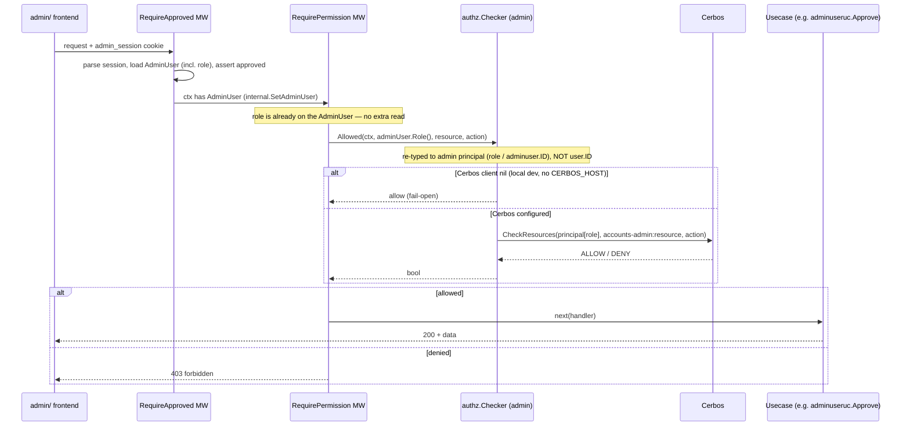
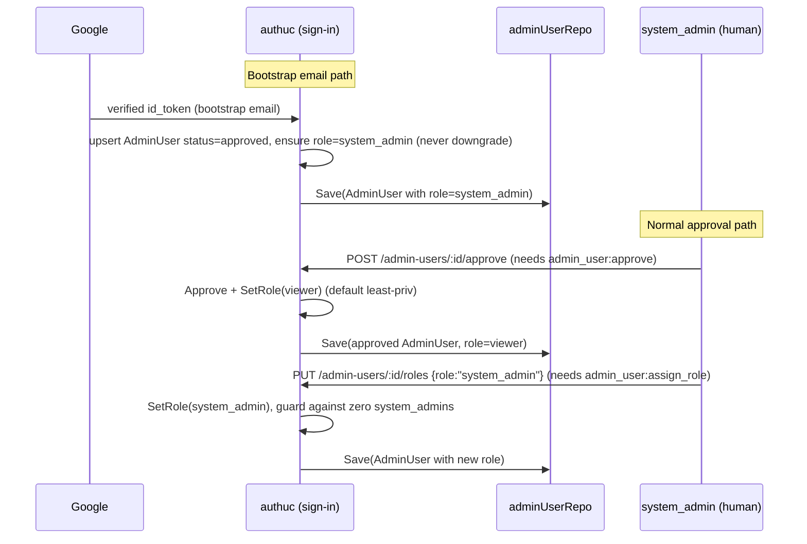

# Admin Role (Granular Admin Permissions)

> **Status: DRAFT for review.** This is a design document (options + trade-offs +
> recommendation) for reearth-dashboard#1316. It is not an implementation. Code
> snippets are illustrative pseudocode only. Items that are genuinely undecided
> are listed under **Open Questions**.
>
> **Selected model (this revision):** an admin has **exactly one role**, stored
> as a `role` enum field **directly on the `adminuser.AdminUser` aggregate**
> (plus a Mongo/Postgres migration adding the field/column) — *not* a separate
> binding aggregate. Enforcement is **Cerbos-based**: the admin's single `role`
> (loaded by `RequireApproved`) becomes the Cerbos principal role, and a
> `RequirePermission` middleware calls the admin `authz.Checker`, which does a
> Cerbos `CheckResources` against the **`accounts-admin`** service policy for the
> route's `(resource, action)`. Because the role lives on the aggregate, the
> checker takes the **already-loaded role / `adminuser.ID`** (not a `user.ID`) and
> needs **no** `permittable`-style repo lookup. This consumes the existing (until
> now dormant) Cerbos admin machinery. An **in-process static check** against the
> role→action matrix in `internal/admin/rbac/definitions.go` was considered but
> **not chosen** for V1 (see Design Question 3): the team chose Cerbos for
> consistency with the end-user `accounts` authorization model. The earlier
> multi-role / separate-binding design (`pkg/adminpermittable`) is retained only
> as a **deferred alternative** (see Design Question 2).

## Document Signature

|           |                                                        |
|-----------|--------------------------------------------------------|
| Creator   | [author]                                               |
| Leader    | [pending]                                              |
| Task Link | reearth-dashboard#1316 (part of epic reearth-dashboard#1233) |
| Developer | [pending]                                              |

## Background / Problem Statement

The admin application (`reearth-dashboard-admin-api`, implemented in this repo
under `server/internal/admin/`) currently treats **every approved admin as
equal**. The only authorization gate is the `RequireApproved` middleware
(`internal/admin/presentation/middleware/require_approved.go`): once an
`adminuser.AdminUser` has `status == approved`, it can call every admin
endpoint — list/read users, list/read workspaces and members, and
approve/reject/revoke *other* admins.

This was a deliberate V1 non-goal of the ADMIN-AUTH epic (reearth-dashboard#1233):

> Role-based permissions inside admin (V1 treats every approved admin as equal).
> Roles are a follow-up if needed.

#1316 is that follow-up. The problem it solves:

1. **No least-privilege.** A read-only operator (e.g. support staff who only
   inspect users/workspaces) is indistinguishable from a super-admin who can
   approve new admins and, in future, mutate/delete data. This is fact: all
   approved-admin routes are grouped under a single `requireApproved` middleware
   in `internal/admin/presentation/router.go` with no per-action check.
2. **Approve/reject of admins is a high-privilege action** currently available
   to any approved admin. Granting or revoking admin access should itself be
   restricted.
3. **The enforcement machinery already exists but is dormant.** The admin Cerbos
   `Checker` (`internal/admin/usecase/authz/checker.go`), the RBAC definitions
   (`internal/admin/rbac/definitions.go`, service `accounts-admin`, single role
   `admin`), and the Cerbos client provider (`internal/admin/di/config.go`,
   `provideCerbosClient`, marked `//nolint:unused` and explicitly retained "for
   reearth-dashboard#1316") are wired but not consumed by any usecase. The
   preceding endpoint work deliberately kept this wiring so that #1316 is a
   *purely additive* change, not a rework. The selected design **consumes** this
   machinery: the `RequirePermission` middleware calls the admin `authz.Checker`,
   which evaluates the `accounts-admin` Cerbos policy. This honors the issue's
   "keep Cerbos" directive by actually using the wiring rather than deleting it.

**Fact vs. opinion.** Facts: the current single-role model, the dormant checker,
the ID-space mismatch described below. Opinions/recommendations: the specific
role set, the choice to store the role on the aggregate, the Cerbos enforcement
path, and the rollout ordering.

### A critical distinction to make explicit

There are **two separate identity + authorization worlds** in this repository,
and #1316 must not conflate them:

| | End-user world (`accounts`) | Admin world (`accounts-admin`) |
|---|---|---|
| Identity aggregate | `pkg/user` (`user.ID`) | `pkg/adminuser` (`adminuser.ID` = `id.AdminUserID`) |
| Cerbos service name | `accounts` (`internal/rbac`) | `accounts-admin` (`internal/admin/rbac`) |
| Role binding today | `pkg/permittable` binds `user.ID` → `role.ID` (+ workspace roles) | none — every approved admin is equal |
| Roles today | `role.RoleOwner/Maintainer/Writer/Reader/Self` | single string `"admin"` |

The existing `pkg/permittable` binds **end-users** to **workspace roles** for the
**`accounts`** service. It is keyed by `user.ID`
(`permittable.Repo.FindByUserID(ctx, user.ID)`). Admin users live in a
**different ID space** (`adminuser.ID`). The **selected design sidesteps this
mismatch entirely**: the admin's role is stored on the `adminuser.AdminUser`
aggregate itself (its own ID space), so no `permittable`-style binding keyed by
`user.ID` is involved at all.

There is a latent bug in the (until now dormant) checker that is now **in scope
and MUST be fixed**, because the selected design consumes the checker: today
`authz.Checker.Allowed(ctx, caller user.ID, …)` takes a `user.ID`, but the admin
principal is an `adminuser.ID`. The checker was written against the end-user
permittable repo and never exercised. The fix is to **re-type `Allowed` to take
the admin principal** — the already-loaded `role` (or an `adminuser.ID` + a cheap
`AdminUser` load) — not `user.ID`, and to update the provider-set signature in
`internal/admin/di` accordingly. Because the role lives on the aggregate, the
checker does **not** need a `permittable` repo lookup at all.

## Goals

1. Approved admins are **no longer all-equal**: each admin endpoint's access is
   decided by the caller's single admin **role**, checked via **Cerbos**
   (`accounts-admin` service policy) by a `RequirePermission` middleware layered
   on top of `RequireApproved`.
2. Define a first-class **super-admin role** plus at least one lower-privilege
   role, with a clear default, so no existing approved admin is locked out on
   rollout.
3. Store the admin's role on the `adminuser.AdminUser` aggregate (a `role` enum
   field), including how the role is granted at/after approval and how the
   bootstrap admin(s) obtain the highest role.
4. Keep the `accounts-admin` role→action matrix (`resourceRules` in
   `internal/admin/rbac/definitions.go`) as the single source of truth for what
   each role may do. It is compiled into the `accounts-admin` Cerbos policy via
   the policy generation path (`cmd/policy-generator`, Makefile `gen-policies`),
   which the checker evaluates at runtime.
5. Enforce the check on the admin resource endpoints **additively** — no change
   to paths or response shapes; only new `403` outcomes for under-privileged
   callers.
6. Rollout is safe: the migration backfills existing approved admins to the
   default (super-admin) role, and the check can be enabled in a
   fail-open → fail-closed order so nobody is locked out mid-deploy.

**Impact when reached:** support-tier admins can be given read-only access;
approve/reject/revoke and (future) mutations require super-admin; the security
posture moves from all-or-nothing to least-privilege without touching end-user
authorization.

## Non-Goals

1. **Admin UI for managing roles** — a separate frontend follow-up. This doc
   specifies the *server* endpoint(s) for role assignment but not the UI.
2. **Changing end-user (`accounts`) authorization** — `pkg/user`,
   `pkg/permittable` end-user bindings, and the `accounts` Cerbos policy are
   untouched.
3. **A general audit-log** for role changes beyond what already exists
   (`approvedBy`/`approvedAt` on the admin user). A dedicated `admin_actions`
   collection remains out of scope (matching the epic's non-goal), though role
   changes SHOULD be logged (see Post Deployment).
4. **Fine-grained per-resource-instance rules** (e.g. "admin X may only see
   workspaces in region Y"). V1 is per-action/per-resource-type, not
   per-instance.
5. **Removing the Cerbos wiring** — #1316 keeps and reuses it, as the issue states.

## Functional Requirements

1. Every existing approved-admin route maps to a `(resource, action)` pair on the
   `accounts-admin` matrix and is checked before the usecase runs.
2. The check adds **zero extra datastore reads** per request beyond what
   `RequireApproved` already does: the caller's role is already on the `AdminUser`
   loaded into the echo context, so the checker builds the Cerbos principal from
   that role without any `permittable`-style lookup. It adds exactly **one Cerbos
   `CheckResources` gRPC call** per protected request.
3. Latency budget: the added Cerbos `CheckResources` gRPC call should add
   **< ~15 ms p95** to admin requests. Admin traffic is very low volume (a
   handful of Eukarya staff), so throughput is not a concern.
4. Local development must be unaffected. With Cerbos unconfigured (local dev,
   `CERBOS_HOST` empty), checks must continue to **fail open** exactly as
   `provideCerbosClient` / `Checker` already do (nil client ⇒ allow).
5. The bootstrap admin(s) (`REEARTH_ACCOUNTS_ADMIN_BOOTSTRAP_EMAILS`) must always
   resolve to the super-admin role, even on a brand-new database.
6. Backward compatibility: existing approved admins retain full access after the
   migration (their `role` field is backfilled to super-admin per the rollout
   plan).

## Solution Options

The design breaks into eight questions. The core decisions are now **final**:
**Design Question 2** documents the *selected* storage model for the role (a
field on the `AdminUser` aggregate) versus a demoted deferred alternative; and
**Design Question 3** documents the *selected* enforcement style (**Cerbos**),
with the in-process static check preserved as a considered-but-rejected
alternative. The other questions have a single recommended approach with
rationale.

### Design question 1 — Role model for admins

**DECIDED: two admin role *types* for V1 (`system_admin`, `viewer`), a small,
fixed enum modelled exactly like the existing `adminuser.Status` enum.**

| Role type | Role name (enum value) | Intended holders | Capabilities |
|---|---|---|---|
| System admin (super-admin) | `system_admin` | Eukarya platform operators, bootstrap admins | Everything: manage admins (approve/reject/revoke), assign roles, read + (future) mutate all resources |
| Viewer (read-only) | `viewer` | Support / read-only staff | List/read users, workspaces, members, admin-users. No approve/reject, no mutations, no role assignment |

These are the values of a new `role` enum **field on `adminuser.AdminUser`**
(see Design Question 2 for the field and the enum type). The enum is modelled on
the existing `adminuser.Status` enum in `server/pkg/adminuser/enum.go` (a
`type Role string`, a fixed slice of valid values, a `Valid()` method, and a
`RoleFrom(string)` parse/validate function).

Rationale:
- **DECIDED — rename** the existing single Cerbos role `"admin"` →
  `system_admin` (see Migration for the string-compatibility note). Starting with
  exactly two roles satisfies the issue ("a first-class system-admin role and any
  additional admin roles we need") while keeping the matrix tiny.
- A fixed enum (mirroring the `adminuser.Status` pattern in `enum.go`) is
  preferable to arbitrary user-defined admin roles for V1: the set of admin
  capabilities is small and closed, and a fixed enum keeps the role→action
  matrix a compile-time constant in `internal/admin/rbac/definitions.go`, from
  which `cmd/policy-generator` compiles the `accounts-admin` Cerbos policy.
- A third role (e.g. `user_admin` who may approve admins but not touch
  workspaces) is easy to add later by extending the enum + the matrix; it is
  called out as an open question rather than built now.

### Design question 2 — Where the admin's role lives (SELECTED: field on the aggregate)

**Selected design: a single `role` enum field directly on the
`adminuser.AdminUser` aggregate, plus a Mongo/Postgres migration adding the
field/column.** An admin has **exactly one** role. This is the simplest storage
change and it is now the primary model (it was previously written up as a
"rejected preface"; that judgement is reversed — see the deferred alternative
below for the multi-role design and why it is deferred rather than chosen).

The role is modelled exactly like the existing `adminuser.Status` enum
(`server/pkg/adminuser/enum.go`): a `type Role string`, a fixed set of valid
values, a `Valid()` method, and a `RoleFrom(string)` parse/validate helper.

```go
// server/pkg/adminuser/enum.go  (illustrative addition, mirroring Status)
var (
    RoleSystemAdmin = Role("system_admin")
    RoleViewer      = Role("viewer")

    roles = []Role{
        RoleSystemAdmin,
        RoleViewer,
    }

    ErrInvalidRole = errors.New("invalid role")
)

type Role string

func (r Role) Valid() bool   { return slices.Contains(roles, r) }
func (r Role) String() string { return string(r) }

func RoleFrom(s string) (Role, error) {
    role := Role(strings.ToLower(s))
    if role.Valid() {
        return role, nil
    }
    return role, ErrInvalidRole
}
```

The `role` field is added to the aggregate alongside `status`, with a getter and
a domain mutator, mirroring the existing `status` field and `Approve(by ID)`
method:

```go
// server/pkg/adminuser/adminuser.go  (illustrative additions)
type AdminUser struct {
    // ... existing fields ...
    role   Role   // NEW: the admin's single role
    status Status
    // ...
}

func (u *AdminUser) Role() Role {
    if u == nil {
        return ""
    }
    return u.role
}

// SetRole changes the admin's role. Caller-side guards (zero/last system_admin
// protection) live in the usecase — see Design Question 5.
func (u *AdminUser) SetRole(r Role) {
    if u == nil {
        return
    }
    u.role = r
    u.updatedAt = time.Now()
}

// IsSystemAdmin is a convenience helper (e.g. for the zero/last-system_admin guard).
func (u *AdminUser) IsSystemAdmin() bool {
    return u != nil && u.role == RoleSystemAdmin
}
```

```go
// server/pkg/adminuser/builder.go  (illustrative addition, mirroring Status)
func (b *Builder) Role(role Role) *Builder {
    b.u.role = role
    return b
}
// Build() defaults an unset role to RoleSystemAdmin only where appropriate
// (e.g. bootstrap); otherwise a role should be set explicitly. See Q6/Q7.
```

Storage: the `role` field is added to the existing admin-user document/row via a
Mongo/Postgres migration (see Design Question 7). **No new collection or table.**
The `adminuser` repositories (`internal/infrastructure/{mongo,postgres,memory}/`)
gain the new field in their document mapping; `adminUserRepo.Save` persists it.

**Why this is the selected model**
- **Minimal change.** One field + one getter + one mutator + one builder method +
  one additive migration. No new aggregate, no new repo interface, no new infra
  across three backends.
- **No ID-space confusion.** The role lives on the admin aggregate in its own ID
  space (`adminuser.ID`); there is no `permittable`-style binding keyed by
  `user.ID`, so the crux problem simply does not arise.
- **Simplifies the Cerbos check (Design Question 3).** Because `RequireApproved`
  already loads the `AdminUser` into the echo context, the middleware reads the
  role directly and hands it to the `authz.Checker` as the Cerbos principal role —
  **no `permittable`-style repo lookup and no extra datastore read** are needed to
  resolve the principal.
- **Single-role is sufficient for V1.** The two roles are mutually exclusive
  privilege tiers; nothing in the endpoint matrix needs a role *list*.

**Trade-off accepted:** an admin is limited to exactly one role. If a genuine
need for multiple roles per admin ever appears, migrate to the deferred
alternative below. This is explicitly listed as a (now-decided) Open Question:
single-role is chosen for V1.

---

#### Deferred alternative (if multi-role per admin becomes necessary)

*Revisit only if multi-role per admin is ever needed.* The earlier design
introduced a **new** binding aggregate, `pkg/adminpermittable` (name TBD),
binding `adminuser.ID` → `[]role.ID` and reusing the existing `pkg/role`
aggregate for role definitions, with its own `admin_permittables` collection/
table mirroring `pkg/permittable` across the mongo/postgres/memory backends, plus
a migration seeding role rows and backfilling bindings. The dormant
`authz.Checker` would be re-typed to take an `adminuser.ID` and a
`FindByAdminUserID` repo, resolving role IDs → role names → a Cerbos principal
with a role *list*.

Its advantages were: support for **multiple roles per admin**, reuse of the
well-understood `permittable → roles → Cerbos principal` pattern, and clean
bounded-context separation. Its cost — a new aggregate + repo implementations
across three backends + a new collection/table + a migration — is real, and its
sole distinguishing advantage (multiple roles per admin) is not needed for V1
(single-role is sufficient). It is therefore **deferred, not deleted**: the
reasoning is preserved here so the path is available if requirements change.
(Note: even under this alternative, enforcement would still be Cerbos-based; the
only difference is where the role binding lives.)

> A rejected sub-alternative was reusing the *existing* `pkg/permittable`
> collection for admins by casting `adminuser.ID` into `user.ID`. That is a
> non-starter: it collides two distinct ULID ID spaces in one `user.ID`-typed,
> `user.ID`-indexed collection that end-user authorization
> (`internal/usecase/interactor/cerbos.go`) also reads, risking cross-context
> data bleed. It is recorded only to note it was considered and rejected.

### Design question 3 — Enforcement (SELECTED: Cerbos)

Enforcement is a **permission middleware** applied per route/group: it maps the
matched route to a `(resource, action)` pair and checks before the handler. This
keeps the check declarative and colocated with the routing table in
`internal/admin/presentation/router.go`, and the admin user is already loaded
into the echo context by `RequireApproved` (`internal.GetAdminUser(c)`), so the
middleware has everything it needs without threading anything through every
usecase constructor.

#### SELECTED — Cerbos-based check

The `RequirePermission` middleware reads the caller's single role from the
already-loaded `AdminUser` and hands it to the admin `authz.Checker`, which does a
Cerbos `CheckResources` against the `accounts-admin` service policy for the
route's `(resource, action)`. The principal's role is the admin's single role.
Because the role is on the aggregate, the checker is **re-typed to accept the
admin principal** — the loaded `adminuser.Role` (or the `adminuser.ID` + a cheap
`AdminUser` load) — **not** a `user.ID`, and needs **no** `permittable` repo
lookup.

```go
// illustrative — presentation/middleware/require_permission.go (SELECTED: Cerbos)
func RequirePermission(chk *authz.Checker, resource, action string) echo.MiddlewareFunc {
    return func(next echo.HandlerFunc) echo.HandlerFunc {
        return func(c echo.Context) error {
            u, err := internal.GetAdminUser(c) // set by RequireApproved; role already loaded
            if err != nil {
                return echo.NewHTTPError(http.StatusUnauthorized)
            }
            // Checker re-typed to take the admin principal's role / adminuser.ID
            // (NOT user.ID); builds the Cerbos principal from the loaded role.
            ok, err := chk.Allowed(c.Request().Context(), u.Role(), resource, action)
            if err != nil {
                return echo.NewHTTPError(http.StatusInternalServerError)
            }
            if !ok {
                return echo.NewHTTPError(http.StatusForbidden, "forbidden")
            }
            return next(c)
        }
    }
}
```

Why Cerbos was chosen:
- **Consistency with the end-user `accounts` authorization model.** The admin
  service enforces authorization the same way the rest of the platform does
  (`internal/usecase/interactor/cerbos.go`), rather than introducing a second,
  divergent in-process enforcement style.
- **Consumes the existing (dormant) machinery** (`internal/admin/rbac`,
  `internal/admin/usecase/authz`, `provideCerbosClient`) rather than leaving it
  unused — honoring the "keep Cerbos" directive by actually using it.
- **Fail-open in local dev is already handled** — a nil Cerbos client (no
  `CERBOS_HOST`) allows, so local development needs no external dependency.

Required fix (now in scope): the checker's `user.ID`-vs-`adminuser.ID` typing bug
must be reconciled — re-type `authz.Checker.Allowed` to take the admin principal
(role / `adminuser.ID`) and update its provider-set signature in
`internal/admin/di`. See the critical-distinction note above.

#### Considered alternative (rejected for V1) — in-process static check

An alternative was to have `RequirePermission` read the caller's role from the
already-loaded `AdminUser` and check it against the static role→action matrix
in-process — the same `resourceRules` data in `internal/admin/rbac/definitions.go`,
exposed via a small helper (e.g. `rbac.Allowed(role, resource, action) bool`) —
with **no Cerbos gRPC call, no permittable repo, and no extra datastore read**.

```go
// illustrative — REJECTED alternative: in-process static check
func RequirePermission(resource, action string) echo.MiddlewareFunc {
    return func(next echo.HandlerFunc) echo.HandlerFunc {
        return func(c echo.Context) error {
            u, err := internal.GetAdminUser(c)
            if err != nil { return echo.NewHTTPError(http.StatusUnauthorized) }
            if !rbac.Allowed(u.Role().String(), resource, action) { // static matrix lookup
                return echo.NewHTTPError(http.StatusForbidden, "forbidden")
            }
            return next(c)
        }
    }
}
```

Its trade-offs (preserved for the record): it was **simpler** — no external
dependency, no per-request Cerbos call, zero added latency, and it would have made
the checker's `user.ID` typing bug moot by not using the checker at all. **Why it
was rejected:** the team chose Cerbos for **consistency with the end-user
`accounts` authorization model**; running two different enforcement mechanisms in
one codebase was judged the larger long-term cost. This path remains available if
the Cerbos policy-distribution dependency (Design Question 4) ever proves
prohibitive.

**Endpoint → resource/action mapping** (existing routes from `router.go`, plus
near-future mutations). This table drives the `accounts-admin` Cerbos policy
(generated from the matrix in `internal/admin/rbac/definitions.go`):

| Method / Path | Resource | Action | Min role |
|---|---|---|---|
| `GET /api/v1/admin-users` | `admin_user` | `list` | viewer |
| `POST /api/v1/admin-users/:id/approve` | `admin_user` | `approve` | system_admin |
| `POST /api/v1/admin-users/:id/reject` | `admin_user` | `reject` | system_admin |
| `GET /api/v1/users` | `user` | `list` | viewer |
| `GET /api/v1/users/:id` | `user` | `read` | viewer |
| `GET /api/v1/users/:id/workspaces` | `user` | `read` | viewer |
| `GET /api/v1/workspaces` | `workspace` | `list` | viewer |
| `GET /api/v1/workspaces/:id` | `workspace` | `read` | viewer |
| `GET /api/v1/workspaces/:id/members` | `workspace` | `read_member` | viewer |
| *(future)* `PATCH/DELETE users/workspaces` | resp. | `edit` / `delete` | system_admin |
| `PUT /api/v1/admin-users/:id/roles` (see Q5) | `admin_user` | `assign_role` | system_admin |

Notes:
- `/api/v1/me`, `/api/v1/auth/*` stay public / session-only (no permission check)
  — they are the pending/rejected screens' lifeline and must work for any status.
- `approve`/`reject` are **new actions** not present in today's
  `resourceRules` (which only has `list/read/edit/delete`). Making
  approve/reject their own actions (rather than folding into `edit`) is what lets
  a viewer read the admin-user list while only system_admin can act on it.
- A new resource `admin_user` is added (distinct from the existing `user`
  resource, which refers to *end-users* the admin inspects).
- "Min role" is enforced via Cerbos: the matrix is compiled into the
  `accounts-admin` Cerbos policy, and the checker evaluates `CheckResources`
  against it for each `(resource, action)`.

### Design question 4 — The role→action matrix and the `accounts-admin` Cerbos policy (REQUIRED for V1)

`internal/admin/rbac/definitions.go` evolves from single-role to multi-role by
(1) adding role-name constants, (2) adding the `admin_user` resource and the
`approve`/`reject` actions, and (3) listing multiple roles per action.
**`resourceRules` is the single source of truth for the matrix**, and it is
**compiled into the `accounts-admin` Cerbos policy** — the checker evaluates that
policy at runtime. Generating and landing this policy is **required for V1**.

```go
// illustrative evolution of definitions.go
const (
    roleSystemAdmin = "system_admin"
    roleViewer      = "viewer"
)
const (
    ResourceAdminUser = "admin_user"
    // ResourceUser, ResourceWorkspace unchanged
)
const (
    ActionApprove    = "approve"
    ActionReject     = "reject"
    ActionAssignRole = "assign_role"
    /* + existing list/read/edit/delete */
)

var resourceRules = []ResourceRule{
    {Resource: ResourceAdminUser, Actions: map[string][]string{
        ActionList:       {roleSystemAdmin, roleViewer},
        ActionApprove:    {roleSystemAdmin},
        ActionReject:     {roleSystemAdmin},
        ActionAssignRole: {roleSystemAdmin},
    }},
    {Resource: ResourceUser, Actions: map[string][]string{
        ActionList: {roleSystemAdmin, roleViewer},
        ActionRead: {roleSystemAdmin, roleViewer},
        ActionEdit: {roleSystemAdmin}, ActionDelete: {roleSystemAdmin},
    }},
    {Resource: ResourceWorkspace, Actions: map[string][]string{
        ActionList: {roleSystemAdmin, roleViewer},
        ActionRead: {roleSystemAdmin, roleViewer},
        ActionEdit: {roleSystemAdmin}, ActionDelete: {roleSystemAdmin},
        // plus read_member for members endpoint
    }},
}
```

`DefineResources` (the loop that turns `resourceRules` into
`generator.ResourceDefinition`s) needs no structural change — it already iterates
actions→roles generically; only the data grows. This one matrix definition is the
source from which the `accounts-admin` Cerbos policy is generated.

**Cerbos generation & load path — REQUIRED for V1:**
- Policies are generated by `server/cmd/policy-generator/main.go`, which iterates
  a `policySet` list — one entry for the main `accounts` service
  (`internal/rbac`) and one for `accounts-admin` (`internal/admin/rbac`) — and
  calls `reearthx`'s `generator.GeneratePolicies(serviceName, defineResources,
  outputDir)`, writing YAML into the `policies` dir (`PolicyFileDir = "policies"`
  for both). It is invoked via `make gen-policies` (`go run ./cmd/policy-generator`).
- The concrete deliverable for V1: regenerate the `accounts-admin` policy with
  `make gen-policies` and land the updated YAML through whatever path the
  `accounts` policy already uses.

> **⚠ Dependency / Risk (launch blocker) — runtime policy distribution.** The
> repo's `policies/` directory (repo root) contains checked-in policy YAML (e.g.
> `service_resource.yaml`, `dashboard_*.yaml`), and Cerbos loads a policy set at
> runtime. **The exact mechanism by which the generated `accounts-admin` YAML
> reaches the running Cerbos instance is not evidenced in this repo.** CLAUDE.md
> states other services' definitions are "synced to GCS via GitHub Actions", but
> **no such workflow exists** under this repo's `.github/workflows/`. Because
> enforcement is now Cerbos-based, the policy MUST reach the running Cerbos
> instance for the check to work — if it does not load, protected endpoints will
> fail. **This must be confirmed with the platform/Cerbos owner before rollout**
> and is the single remaining open dependency for the feature (see Open
> Questions).

### Design question 5 — Role assignment flow

**Who may assign/change admin roles:** system_admin only (action
`admin_user:assign_role`, enforced by the same middleware/matrix).

**How:** the assignment **mutates the `role` field on the target
`adminuser.AdminUser`** (via the domain method `SetRole` from Design Question 2)
and persists it with `adminUserRepo.Save`. There is no separate binding to
create.

1. **On approval.** When a system_admin approves a pending admin
   (`adminuseruc/approve.go`), the newly approved admin's `role` field is set to
   the **default role = `viewer`**. This makes least-privilege the default: new
   admins can look but not act until explicitly elevated. (Bootstrap admins are
   the exception — see Q6.)
2. **Explicit change.** A new endpoint sets the role:

   | Method / Path | Auth | Description |
   |---|---|---|
   | `PUT /api/v1/admin-users/:id/roles` | system_admin | Set the target admin's single role. Body: `{ "role": "viewer" }`. The usecase loads the target AdminUser, calls `SetRole`, and `adminUserRepo.Save`s it. |

   Guards mirror the existing self-modification / lock-out rules in
   `adminuseruc`: an admin cannot demote their **own** last `system_admin` role,
   and the system must never reach **zero** `system_admin`s (count admins whose
   `role == system_admin` before persisting a demotion) — analogous to the
   existing "last approved admin cannot be rejected" rule in the approve/reject
   usecases.

The UI for this endpoint is a separate follow-up (non-goal). For V1 the endpoint
+ guards are sufficient; role changes can be driven by API/script until the UI
lands. (The path is kept plural `/roles` for URL stability, but the body carries
a single `role`.)

### Design question 6 — Bootstrap

The bootstrap admins (`REEARTH_ACCOUNTS_ADMIN_BOOTSTRAP_EMAILS`, already handled
at sign-in in `authuc` where a bootstrap email is auto-approved instead of
pending) must receive **`system_admin`**, otherwise the very first admin could
approve others but not do anything privileged, and on a fresh DB nobody could
ever gain `system_admin`.

Mechanism: at the point a bootstrap email is auto-approved (sign-in upsert in
`authuc`), also ensure the admin's `role` field is set to `system_admin`
(idempotent create-or-elevate: set it on create; on an existing record elevate to
`system_admin` but **never downgrade** an already-`system_admin`). This runs on
every bootstrap sign-in, so re-adding an email to the env var can re-grant
`system_admin` if it was lost — a deliberate safety valve. Because it is keyed
off config, it avoids both the chicken-and-egg problem and the unsafe "first
login wins" pattern (consistent with the epic's bootstrap philosophy).

### Design question 7 — Migration / rollout / backward-compat

**Data migration (add + backfill the `role` field):**
1. Add the `role` field/column to the admin-user documents/rows (Mongo: add the
   field to `adminuser` docs; Postgres: `ALTER TABLE ... ADD COLUMN role`).
   **No new collection or table.**
2. Backfill: set `role = system_admin` for every existing `adminuser` with
   `status == approved` (the **default backfill role**, chosen for a zero-lockout
   deploy). Idempotent on re-run.

**Rollout ordering (fail-open → fail-closed) — the key to not locking anyone out:**

- **Step A (deploy, checks effectively no-op):** land the `accounts-admin` Cerbos
  policy (see Q4) and ship the migration that adds and backfills the `role` field
  = **`system_admin`** for all currently-approved admins. Ship the
  `RequirePermission` middleware. It is *effectively permissive* by virtue of
  every existing admin holding `system_admin` (so every Cerbos check ALLOWs) —
  **no feature flag is required** (an env-var flag is available only as an
  optional extra safety valve). Result: identical behavior to today; nobody loses
  access.
- **Step B (enable enforcement):** the middleware is active and calling Cerbos;
  confirm the `accounts-admin` policy is loaded by the running Cerbos instance
  (the distribution dependency from Q4). All existing admins still pass because
  they hold `system_admin`.
- **Step C (tighten):** a system_admin demotes the admins who should be read-only
  to `viewer` via the Q5 endpoint (setting their `role` field). New admins default
  to `viewer` on approval from this point. This is a data/operations step, not a
  deploy.

This ordering means the risky transition (all-equal → scoped) happens as a
deliberate, reversible **data** change (Step C), long after the code is safely
deployed.

**Backward compatibility:** paths and response shapes are unchanged; the only new
behavior is `403` for an under-privileged caller, which cannot occur until Step C
demotes someone. The migration is additive (one new field/column, backfilled); no
existing field is altered and no collection/table is added.

### Design question 8 — Test plan

Covered in the **Test Plan** section below.

## Design

### Request flow (per protected admin endpoint)



### Role assignment / bootstrap flow



## Potential Impact

1. **Storage.** No new collection/table — just one added `role` field/column on
   the existing admin-user documents/rows. Negligible size/CPU impact.
2. **Latency.** +1 Cerbos `CheckResources` gRPC call per protected request. The
   role is already loaded by `RequireApproved` (no extra datastore read to resolve
   the principal). Admin traffic is very low volume, so the added call's impact is
   immaterial.
3. **New failure mode.** If Cerbos is configured but the `accounts-admin` policy
   fails to load (or is never distributed — see Q4), checks could deny legitimate
   admins and return `500` on protected endpoints (fail-closed under error).
   Mitigated by the fail-open nil-client path in dev, Step A/B rollout
   verification, and confirming the policy-distribution path before rollout.
4. **Cross-context safety.** The admin role lives on the admin aggregate in its
   own ID space; there is zero risk to end-user (`accounts`) authorization.
5. **Lock-out risk** if the zero-`system_admin` guard or bootstrap grant is
   buggy — explicitly tested (below) and mitigated by the re-grantable bootstrap
   env var.

## Test Plan

1. **Unit — the `Role` enum** in `server/pkg/adminuser/enum_test.go` (mirroring
   the existing `Status` enum tests): `RoleSystemAdmin`/`RoleViewer` are `Valid()`;
   an unknown value is invalid; `RoleFrom` parses/normalizes case and rejects junk.
2. **Unit — the role→action matrix** in `internal/admin/rbac` (the data compiled
   into the `accounts-admin` policy) and the **admin `authz.Checker`**:
   - `system_admin` allowed for `admin_user:approve`, `admin_user:assign_role`,
     `user:edit`, `workspace:list`.
   - `viewer` allowed for `*:list`/`*:read`, denied for `admin_user:approve`,
     `user:edit`, `admin_user:assign_role`.
   - unknown role ⇒ deny.
   - `authz.Checker` (re-typed to the admin principal) allow/deny per role with a
     mock/stub Cerbos; nil Cerbos client ⇒ allow (fail-open) preserved.
3. **Unit — domain role setter + assignment guards** in `pkg/adminuser` and
   `adminuseruc`:
   - `SetRole` updates the field and `updatedAt`.
   - approve sets the default `viewer` role.
   - cannot demote the last `system_admin` (self or global).
   - bootstrap ensure-role is idempotent and never downgrades an existing
     `system_admin`.
4. **Endpoint — 403 behavior** (handler tests, mirroring existing
   `handler_test.go` files): a `viewer` session gets `403` on
   `POST /admin-users/:id/approve` and `200` on `GET /users`; a `system_admin`
   gets `200` on both. Verify paths/response shapes are unchanged for allowed
   calls (backward-compat assertion). Use a mock/stub Cerbos checker so these
   handler tests need no live Cerbos.
5. **Migration / backfill** (integration, `make test-integration`, mongo +
   postgres): after running the migration on a DB with N approved admins, every
   approved admin has `role == system_admin`; the migration is idempotent on
   re-run and adds the field/column without altering existing data.
6. **Policy generation**: `make gen-policies` produces a valid `accounts-admin`
   policy containing the new resources/actions/roles; a golden-file or Cerbos
   `compile` check in CI. Required for V1.

## Deployment Plan

1. **Backward compatible?** Yes, if rolled out per Steps A→B→C. Code deploy alone
   (Step A) is behavior-preserving because all existing admins are backfilled to
   `system_admin`.
2. **Partial deployment?** Yes. The admin API is a separate binary
   (`cmd/reearth-accounts-admin`); this changes only the admin path. The check
   can additionally sit behind an optional feature flag for a staged enable, but
   the backfill (everyone `system_admin` until demoted) already makes Step A/B
   safe without one.
3. **Land the `accounts-admin` Cerbos policy.** The generated policy (Q4) MUST
   reach the running Cerbos instance **before/at Step A**, via the (to-be-
   confirmed) distribution path. This is a hard launch dependency — if the policy
   is not loaded, protected endpoints fail. Confirm the mechanism with the
   platform/Cerbos owner first.
4. **Who to notify?** The admin operators (their capabilities may narrow at Step
   C) and the platform/Cerbos owner (policy generation + distribution path —
   see Q4).
5. **Config changes?** `CERBOS_HOST` must be set in prod for the admin service
   (already required by `provideCerbosClient`); locally it may be empty (checks
   fail open). Confirm `REEARTH_ACCOUNTS_ADMIN_BOOTSTRAP_EMAILS` is set so the
   bootstrap role grant works. Optional feature-flag env var if we choose to gate
   Step B (not required).
6. **DDL/DML before deploy?** Yes — the additive migration that adds the `role`
   field/column and backfills it (no new table/collection). Runs via the existing
   migration frameworks (mongo `internal/infrastructure/mongo/migration`, postgres
   `internal/infrastructure/postgres/migration`). Note: admin API's DI does *not*
   run migrations (it "only connects"); the migration must be owned by the main
   service startup or a migration job, consistent with the existing split.

## Rollback Plan

1. Notify the admin channel on Slack.
2. **Toggle the optional feature flag off** (only if one was added) — reverts to
   all-approved-equal instantly, no redeploy. Not present by default.
3. If no flag (the default): **redeploy the previous admin-API image** — the permission
   middleware disappears; `RequireApproved` alone gates again. The added `role`
   field is inert when unused, so no data rollback is needed.
4. If Step C demotions caused a lock-out: **re-grant `system_admin`** to a locked
   -out operator via the (idempotent, re-runnable) bootstrap env var — add their
   email to `REEARTH_ACCOUNTS_ADMIN_BOOTSTRAP_EMAILS` and have them re-sign-in.
5. The migration is additive; it does not need reverting. The added `role`
   field/column is simply ignored by the previous image. If truly necessary, a
   script can drop the column/field.

## Post Deployment

- **Checklist**
  - Verify a `system_admin` can approve/reject and read everything (GUI).
  - Verify a `viewer` can read lists/details but gets `403` on approve/reject and
    role assignment.
  - Verify a freshly approved admin defaults to `viewer`.
  - Verify at least one `system_admin` always exists (zero-guard) — attempt to
    demote the last one and confirm it is refused.
  - Verify local dev (no `CERBOS_HOST`) still fails open.
- **Metrics**
  - `403` rate on admin endpoints (spike ⇒ mis-scoped role or policy bug).
  - `500` rate on protected endpoints (Cerbos reachability / policy load).
  - Cerbos check latency (p50/p95) on the admin service.
- **Logging (in lieu of a full audit collection):** log role assignments and
  approve/reject with actor + target admin IDs (no PII, per epic constraint), so
  privilege changes are traceable.
- **Alerting**
  - Protected-endpoint success rate: Warning `< 99%`, Danger `<= 95%`.
  - Cerbos check errors (`500`s): Warning `>= 5 min` sustained, Danger `>= 1 h`.
  - Zero `system_admin` accounts: Danger (immediate) — indicates lock-out risk.

## Open Questions

**Decided in this revision:**

- **DECIDED — Enforcement path: Cerbos.** The `RequirePermission` middleware calls
  the admin `authz.Checker`, which evaluates the `accounts-admin` Cerbos policy
  (chosen for consistency with the end-user `accounts` authorization model). The
  in-process static check was considered and **rejected** for V1 (Design Question
  3). The checker's `user.ID`-vs-`adminuser.ID` typing bug is now **in scope** and
  must be fixed (re-type `authz.Checker.Allowed` + its provider-set signature in
  `internal/admin/di`).
- **DECIDED — Single-role vs. multi-role per admin: single-role.** An admin has
  exactly one role. The multi-role `pkg/adminpermittable` design is demoted to a
  deferred alternative (Design Question 2), to be revisited only if multi-role
  becomes necessary.
- **DECIDED — Where the role lives: a `role` enum field on the
  `adminuser.AdminUser` aggregate** (+ additive migration). No separate binding
  aggregate, no new collection/table. This also settles the old "reuse `pkg/role`
  vs. `pkg/adminrole`" question — neither is used; the role is a plain enum on the
  admin aggregate.
- **DECIDED — How many roles for V1: two** (`system_admin`, `viewer`).
- **DECIDED — Rename the existing `"admin"` role to `system_admin`.** Today's
  single Cerbos role is the literal `"admin"` (in `rbac/definitions.go`); it is
  renamed to `system_admin`. Confirm no external policy still references `admin`
  when the regenerated `accounts-admin` policy is distributed.
- **DECIDED — Backfill role: `system_admin`.** Existing approved admins are
  backfilled to `system_admin` for a zero-lockout deploy, then demoted to `viewer`
  in the Step C data operation. New admins default to `viewer` on approval.
- **DECIDED — Feature flag: none.** The deploy is made safe by the backfill
  (everyone is `system_admin` until demoted), not by a flag. An env-var flag
  remains available only as an optional extra safety valve.

**Still open (launch dependency):**

1. **Runtime policy distribution — a launch dependency.** Because enforcement is
   Cerbos-based, the generated `accounts-admin` YAML MUST reach the running Cerbos
   instance for the check to work. The exact path from generated YAML to the
   running Cerbos instance is **not evidenced** in this repo's workflows (CLAUDE.md
   mentions GCS sync via GitHub Actions, but no such workflow exists here). **This
   must be confirmed with the platform/Cerbos owner before rollout** (see Design
   Question 4 and the Deployment Plan). This is the single remaining open item
   blocking launch.

**Deferred (revisit later):**

2. **A third `user_admin` role** (e.g. may approve admins but not touch
   workspaces) — easy to add later by extending the enum + matrix; deferred, not
   built for V1.

## Reviewed by

- Technical Architect: [pending]
- Technical Leader: [pending]
- Peers: [pending]
