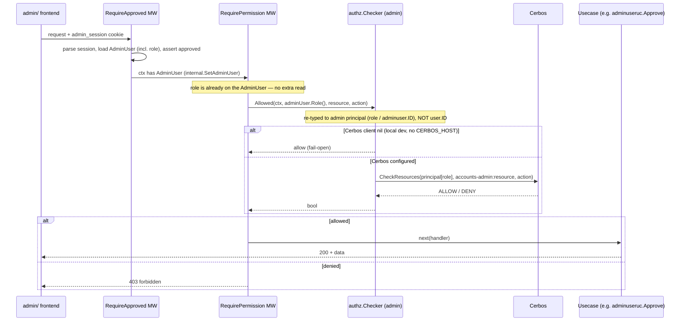

# Admin Role (Granular Admin Permissions)

> **Status: DRAFT** (reearth-dashboard#1316). An admin has **exactly one `role`**
> enum stored **directly on the `adminuser.AdminUser` aggregate**. Enforcement is
> **Cerbos-based** via a `RequirePermission` middleware (layered on
> `RequireApproved`). One open launch dependency remains: runtime policy
> distribution (see Open Questions).

## Roles

Two roles, a small fixed enum.

| Role (enum value) | Holders | Capabilities |
|---|---|---|
| `system_admin` | Platform operators, bootstrap admins | Everything: manage admins (approve/reject/revoke), assign roles, read + (future) mutate all resources |
| `viewer` | Support / read-only staff | List/read users, workspaces, members, admin-users. No approve/reject, no mutations, no role assignment |

The existing single Cerbos role literal `"admin"` is **renamed** to `system_admin`;
a third role (e.g. `user_admin`) is deferred (Open Questions). The enum mirrors the
existing `adminuser.Status` pattern in `server/pkg/adminuser/enum.go`; the
implementation is in reearth/reearth-accounts#282 (in review).

## Storage

**A single `role` enum field directly on the `adminuser.AdminUser` aggregate**,
plus an additive Mongo/Postgres migration (Mongo: add field; Postgres:
`ALTER TABLE ... ADD COLUMN role`) that backfills `role = system_admin` for every
approved admin (idempotent on re-run). **No new collection, table, or aggregate.**
The `adminuser` repos (`mongo`/`postgres`/`memory`) gain the field in their
mappings; `adminUserRepo.Save` persists it.

Why this shape: minimal change; no `user.ID`-vs-`adminuser.ID` confusion (the role
lives in the admin's own ID space, so there is no `permittable`-style lookup); the
role is already loaded by `RequireApproved`, so the check needs **zero extra reads**;
and a single role is sufficient. The deferred multi-role alternative (a binding
aggregate mapping `adminuser.ID` → `[]role.ID`) is documented in git history and
revisited only if multi-role is ever needed.

## Enforcement (Cerbos)

A per-route `RequirePermission` middleware, layered on `RequireApproved`, reads the
already-loaded role from the `AdminUser` in the echo context and hands it to the
admin `authz.Checker`, which does a Cerbos `CheckResources` against the
`accounts-admin` policy for the route's `(resource, action)`. This is **exactly one
Cerbos gRPC call per protected request**. When the Cerbos client is nil
(`CERBOS_HOST` unset), the check **fails open** (allow) — but only outside
production: `provideCerbosClient` fails fast at startup when `CERBOS_HOST` is
unset in production, so admin authorization cannot be silently disabled there.

```go
// server/internal/admin/presentation/middleware/require_permission.go
func RequirePermission(chk *authz.Checker, resource, action string) echo.MiddlewareFunc {
    return func(next echo.HandlerFunc) echo.HandlerFunc {
        return func(c echo.Context) error {
            u, err := internal.GetAdminUser(c) // set by RequireApproved; role loaded
            if err != nil {
                return echo.NewHTTPError(http.StatusUnauthorized)
            }
            ok, err := chk.Allowed(c.Request().Context(), u.Role(), resource, action)
            if err != nil {
                return echo.NewHTTPError(http.StatusInternalServerError)
            }
            if !ok {
                return echo.NewHTTPError(http.StatusForbidden, "forbidden")
            }
            return next(c)
        }
    }
}
```

**Required fix:** re-type `authz.Checker.Allowed` to take the admin principal
(role / `adminuser.ID`), **not** `user.ID`, and update the DI provider-set
signature accordingly.

Cerbos is chosen for consistency with the end-user `accounts` authz model and to
consume the existing dormant machinery. An in-process static check was rejected to
avoid two divergent enforcement mechanisms, but remains a fallback if policy
distribution proves prohibitive.

## Endpoint → resource/action mapping

| Method / Path | Resource | Action | Min role |
|---|---|---|---|
| `GET /api/v1/admin-users` | `admin_user` | `list` | viewer |
| `POST /api/v1/admin-users/:id/approve` | `admin_user` | `approve` | system_admin |
| `POST /api/v1/admin-users/:id/reject` | `admin_user` | `reject` | system_admin |
| `GET /api/v1/users` | `user` | `list` | viewer |
| `GET /api/v1/users/:id` | `user` | `read` | viewer |
| `GET /api/v1/users/:id/workspaces` | `user` | `read` | viewer |
| `GET /api/v1/workspaces` | `workspace` | `list` | viewer |
| `GET /api/v1/workspaces/:id` | `workspace` | `read` | viewer |
| `GET /api/v1/workspaces/:id/members` | `workspace` | `read_member` | viewer |
| *(future)* `PATCH /api/v1/users/:id`, `DELETE /api/v1/users/:id` | `user` | `edit` / `delete` | system_admin |
| *(future)* `PATCH /api/v1/workspaces/:id`, `DELETE /api/v1/workspaces/:id` | `workspace` | `edit` / `delete` | system_admin |
| `PUT /api/v1/admin-users/:id/roles` | `admin_user` | `assign_role` | system_admin |

Notes:
- `/api/v1/me` and `/api/v1/auth/*` stay public / session-only (no permission
  check) — they are the pending/rejected screens' lifeline and must work for any
  status.
- `approve`/`reject` are **new actions** not in today's `resourceRules` (which has
  only `list/read/edit/delete`). Making them distinct actions is what lets a
  viewer read the admin-user list while only system_admin can act on it.
- A new resource `admin_user` is added (distinct from `user`, which refers to the
  end-users the admin inspects).
- "Min role" is enforced via Cerbos against the compiled `accounts-admin` policy.

## Role→action matrix

| Resource | Action | Roles |
|---|---|---|
| `admin_user` | `list` | system_admin, viewer |
| `admin_user` | `approve` / `reject` / `assign_role` | system_admin |
| `user` | `list` / `read` | system_admin, viewer |
| `user` | `edit` / `delete` | system_admin |
| `workspace` | `list` / `read` / `read_member` | system_admin, viewer |
| `workspace` | `edit` / `delete` | system_admin |

`resourceRules` in `server/internal/admin/rbac/definitions.go` is the single source of
truth, compiled into the `accounts-admin` Cerbos policy via `make gen-policies`
(`cmd/policy-generator`).

> **⚠ Dependency / Risk (launch blocker) — runtime policy distribution.**
> Policies are generated locally into the **gitignored** `server/policies/`
> directory (`PolicyFileDir = "policies"` relative to `server/`; `/policies` is in
> `server/.gitignore`). **Nothing is checked in** — there is no `policies/`
> directory at the repo root and no policy YAML committed anywhere. **The
> mechanism by which the generated `accounts-admin` YAML reaches the running
> Cerbos instance is unknown.** `server/CLAUDE.md` mentions a GCS sync via GitHub Actions,
> but **no such workflow exists** under `.github/workflows/`. Because enforcement
> is Cerbos-based, the policy MUST reach the running Cerbos instance or protected
> endpoints will fail. **This must be confirmed with the platform/Cerbos owner
> before rollout** — it is the single remaining open dependency (see Open
> Questions).

## Role assignment & bootstrap

**Who:** system_admin only (`admin_user:assign_role`, enforced by the same
middleware/matrix). Assignment mutates the `role` field on the target `AdminUser`
(via `SetRole`) and persists with `adminUserRepo.Save`.

- **On approval.** A newly approved admin defaults to `viewer` (least-privilege).
  Bootstrap admins are the exception (below).
- **Explicit change:** `PUT /api/v1/admin-users/:id/roles` with body
  `{ "role": "viewer" }` — loads the target, `SetRole`, `Save`. The path stays
  plural `/roles` for URL stability though the body carries a single role.

**Guards:** an admin cannot demote their own last `system_admin`, and the system
must never reach **zero** `system_admin`s (count `role == system_admin` before
persisting a demotion) — analogous to the existing "last approved admin cannot be
rejected" rule.

**Bootstrap.** Bootstrap admins (`REEARTH_ACCOUNTS_ADMIN_BOOTSTRAP_EMAILS`,
already auto-approved at sign-in) receive `system_admin` at the sign-in upsert,
otherwise a fresh DB could never gain one. It is idempotent (set on create, elevate
an existing record) and **never downgrades** an already-`system_admin`. Re-adding an
email to the env var re-grants `system_admin` — the deliberate lock-out recovery
valve.

## Rollout

- **A — deploy.** Land the `accounts-admin` policy, ship the additive migration
  (backfill = `system_admin`) and `RequirePermission`. Every existing admin holds
  `system_admin`, so every check ALLOWs — behavior identical to today, effectively
  permissive; **no feature flag required**.
- **B — verify.** Confirm the `accounts-admin` policy is loaded by the running
  Cerbos instance (the launch-blocker dependency). All existing admins still pass.
- **C — tighten.** A system_admin demotes read-only operators to `viewer` via the
  role endpoint. This is a reversible data operation, not a deploy.

Rollback = redeploy the previous admin-API image; the `role` field is inert when
unused, so no data rollback is needed. If locked out, re-grant via
`REEARTH_ACCOUNTS_ADMIN_BOOTSTRAP_EMAILS`.

## Request flow



## Open questions

1. **Runtime policy distribution** (launch blocker). The generated `accounts-admin`
   YAML MUST reach the running Cerbos instance for the check to work, but nothing is
   checked in and the distribution mechanism is not evidenced in this repo. Confirm
   with the platform/Cerbos owner before rollout.
2. **A third `user_admin` role** (may approve admins but not touch workspaces) —
   easy to add via the enum + matrix; deferred, not built now.
