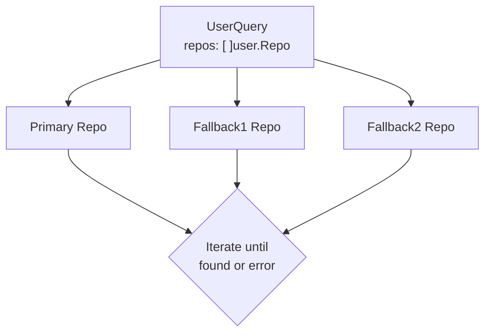
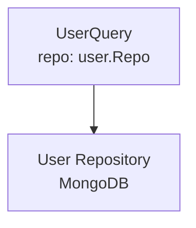

# Remove Multi-User Repository Pattern

## Document Signature

|           |                                                              |
|-----------|--------------------------------------------------------------|
| Creator   | @zombozo12                                                   |
| Leader    | @soneda-yuya                                                 |
| Task Link | https://github.com/eukarya-inc/reearth-dashboard/issues/1125 |
| Developer | @zombozo12                                                   |

## Background / Problem Statement

The `reearth-accounts` service previously implemented a multi-repository fallback pattern for user data:

1. **Current Situation**: The codebase contained `MultiUser` type in `repo/multiuser.go` and `NewMultiUser` function in `interactor/user.go` that allowed querying users from multiple repositories as a fallback mechanism.

2. **Problem**:
   - The `Users []user.Repo` slice in `repo.Container` was originally created as a fallback mechanism to support transitional periods where user data might exist in multiple sources.
   - This pattern introduced unnecessary complexity:
     - `UserQuery` iterated through multiple repos for each query
     - The fallback logic added cognitive overhead and potential for bugs
     - It encouraged data duplication rather than centralization
   - With `reearth-accounts` being the centralized account management service, this multi-repo pattern contradicts the architectural goal of having a single source of truth.

3. **Facts**:
   - `reearth-accounts` is designed to be THE centralized identity and access management service
   - Other services (reearth-cms, reearth-flow) should call reearth-accounts via GraphQL API, not embed user repos
   - The external services currently using `accountinteractor.NewMultiUser` are from `reearthx/account`, a completely different package

## Goals

1. Simplify the user repository architecture by removing the multi-repo fallback pattern
2. Establish `reearth-accounts` as the single source of truth for user data
3. Reduce code complexity in `UserQuery` and related components
4. Remove ~180 lines of unnecessary fallback code (`multiuser.go`)

**Impact after goals reached**:
- Cleaner, more maintainable codebase
- Clearer API contract for user repository
- Reduced potential for bugs in user queries
- Better alignment with centralized account management architecture

## Non-Goals

1. Migrating external services (reearth-cms, reearth-flow) from `reearthx/account` to `reearth-accounts` - this is a separate, future initiative
2. Providing backwards compatibility shims for the removed `NewMultiUser` function
3. Supporting hybrid user data sources within `reearth-accounts`

## Functional Requirements

1. All existing user query functionality must continue to work with a single repository
2. All tests must pass after refactoring
3. No breaking changes to the GraphQL API surface

## Solution Options

**Option 1 (Selected): Breaking Change - Remove MultiUser Completely**

Benefits:
- Cleaner, simpler codebase
- Single source of truth for user data
- Easier to understand and debug
- No confusion about which repo is "primary"

Drawbacks:
- Future migration of reearth-cms/flow will need to use GraphQL API or single repo wrapper

**Option 2 (Not Selected): Keep Backwards Compatibility**

Benefits:
- Smoother migration path for external services

Drawbacks:
- More code to maintain
- Fallback logic adds complexity
- Encourages bad patterns (data duplication)

### Implementation Details

#### Files Modified

1. **`internal/usecase/repo/container.go`**
   - Removed `Users []user.Repo` field from `Container` struct
   - Reordered fields alphabetically (per codebase conventions)

2. **`internal/usecase/interactor/user.go`**
   - Changed `UserQuery.repos []user.Repo` to `UserQuery.repo user.Repo`
   - Simplified `NewUserQuery(repo user.Repo)` signature (removed variadic repos)
   - Removed `NewMultiUser` function
   - Simplified all `UserQuery` methods to use single repo directly (no iteration)
   - Methods updated: `FetchByAlias`, `FetchByID`, `FetchByIDsWithPagination`, `FetchByNameOrAlias`, `FetchByNameOrEmail`, `FetchBySub`, `SearchUser`

3. **`internal/usecase/interactor/workspace.go`**
   - Updated `NewWorkspace` to call `NewUserQuery(r.User)` instead of `NewUserQuery(r.User, r.Users...)`

4. **`internal/infrastructure/mongo/container.go`**
   - Removed `users []user.Repo` parameter from `New` function
   - Removed `Users` field assignment in returned Container

5. **`pkg/infrastructure/container.go`**
   - Removed `Users []user.Repo` field from `Container` struct

6. **`pkg/infrastructure/mongo.go`**
   - Removed `users []user.Repo` parameter from `New` function
   - Updated internal container mapping

7. **`internal/app/repo.go`**
   - Removed `[]user.Repo{}` argument from `mongorepo.New` call

8. **`e2e/common_test.go`**
   - Removed `nil` argument from `mongorepo.New` call

#### Files Deleted

1. **`internal/usecase/repo/multiuser.go`** (~180 lines)
   - Contained `MultiUser` type and all its methods
   - Contained `NewMultiUser` function

#### Files Updated (Tests)

1. **`internal/app/migration_test.go`**
   - Changed `repo.NewMultiUser(memory.NewUserWith(...))` to `memory.NewUserWith(...)`

## Design

### Before (Multi-Repo Pattern)

### After (Single Repo Pattern)

## Potential Impact

1. **External Services**: Services that were planning to use `NewMultiUser` from `reearth-accounts` will need to:
   - Use the GraphQL API for user queries (recommended)
   - Or implement their own fallback logic externally if truly needed

2. **Migration Path for reearth-cms/flow**: When these services migrate to use `reearth-accounts`:
   - They should call reearth-accounts GraphQL API
   - Or use a single `user.Repo` implementation that wraps the GraphQL client
   - This is the architecturally correct approach for centralized account management

## Test Plan

1. Run `go build ./...` - Verify all code compiles
2. Run `go test ./...` - Verify all unit tests pass
3. Verify interactor tests for user queries work correctly
4. Verify workspace tests that use user queries work correctly
5. Verify migration tests pass with updated repo initialization

**Test Results**: All tests pass (excluding e2e tests that require Docker access)

## Deployment Plan

1. **Backward Compatibility**: No - this is a breaking change for internal APIs
2. **Partial Deployment**: Yes - changes are isolated to reearth-accounts
3. **Notification**: Development team should be aware of the architectural change
4. **Configuration Changes**: None required
5. **DDL/DML**: None required - no database schema changes

## Rollback Plan

1. If issues are discovered, revert the commit
2. No data migration is involved, so rollback is straightforward
3. The previous `multiuser.go` file can be restored from git history if needed

## Post Deployment

### Checklist
- [ ] Verify GraphQL user queries work correctly
- [ ] Verify workspace operations that depend on user queries
- [ ] Verify authentication flows work correctly
- [ ] Monitor error logs for any user query failures

### Metrics
- User query latency (should improve slightly due to removed iteration)
- Error rates for user-related operations

### Alerting
- Monitor for increased error rates in user query operations
- Alert on authentication failures

## Reviewed by

- Technical Architect: -
- Technical Leader: -
- Peers: -