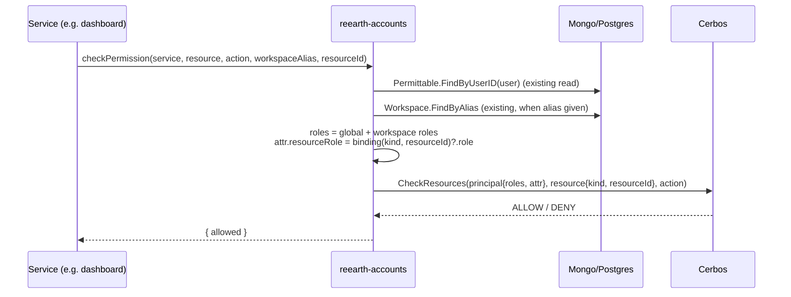
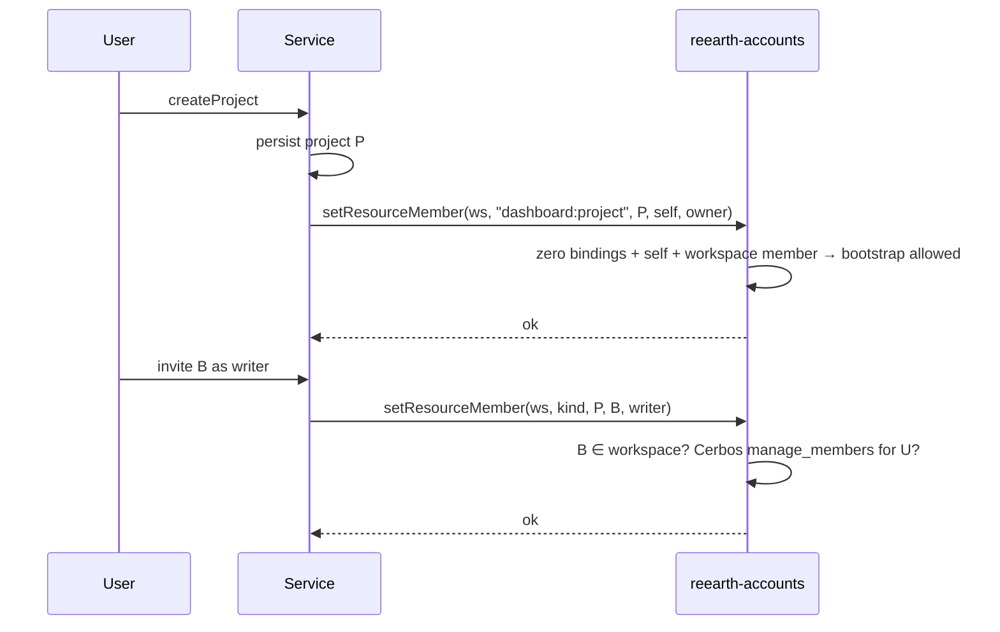
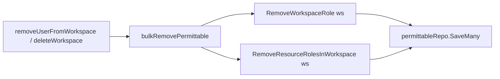

# Resource Role Binding（汎用的なリソース単位メンバーシップ）

> **Status: DRAFT.** 本ドキュメントは [resource-role-binding.md](resource-role-binding.md)
> の日本語版です。内容に差異がある場合は英語版を正とします。
>
> `permittable` に汎用的な **「user × resource → role」** の binding を追加し、
> 各サービス（dashboard、visualizer、cms など）が *project member* のような
> リソース単位のメンバーシップを表現できるようにします。その際、
> **reearth-accounts は project が何であるかを知りません**。最初の利用者は
> `dashboard:project` です。

## Document Signature

|           |                |
|-----------|----------------|
| Creator   | soneda-yuya    |
| Leader    | TBD            |
| Task Link | TBD            |
| Developer | TBD            |

## Background / Problem Statement

### 現状（事実）

- reearth-accounts は Re:Earth プラットフォームの認可のハブです。ユーザーのロールは
  `permittable.Permittable` 集約（`server/pkg/permittable/permittable.go`）に保存されています。
  - `roleIDs`: グローバルロール
  - `workspaceRoles`: `(workspaceID, roleID)` の組。メンバーシップが変わるたびに
    `Workspace` interactor が更新します
    （`server/internal/usecase/interactor/workspace.go` の `updatePermittable` / `bulkRemovePermittable`）。
- `Query.checkPermission(service, resource, action, workspaceAlias)` は、
  *グローバルロール + その workspace のロール* から Cerbos principal を組み立て、
  リソース種別 `"<service>:<resource>"` に対して判定します
  （`server/internal/usecase/interactor/cerbos.go`）。入力には
  **リソースのインスタンス ID がありません**。リソース ID は
  service / resource / workspaceAlias / userId から合成されています。
- `dashboard:project` のようなリソース種別は Cerbos ポリシーとしてすでに存在しますが、
  accounts は `"<service>:<resource>"` を解釈しない文字列として扱っています。

### 課題

プロダクトでは **project 単位のメンバーシップ** が必要です。たとえば
「user A は project P の editor、同じ workspace の user B は P を見られない」といったものです。
現在 accounts が表現できる最も細かい単位は workspace です。

各サービスが project のメンバーシップを独自に実装すると、次の問題が起きます。

1. 招待・ロール変更・削除の API と UI がサービスごとに重複する。
2. 各サービスは、project member を掃除するために **workspace メンバーシップの変更**
   （workspace からのユーザー削除、workspace の削除）に反応しなければならない。
   その情報を持つのは accounts だけなので、サービスごとにイベントや同期の仕組みが必要になる。
   取りこぼすと、すでに抜けた workspace の project にユーザーがアクセスできてしまう。
3. 「project member は workspace のメンバーでなければならない」という制約を、
   accounts を呼ばずにサービス内だけで検証できない。
4. 認可ロジックが、1つの入口で評価される Cerbos ポリシーではなく N 個のサービスに分散する。

### 制約（この設計の形を決めている理由）

accounts は *project* のドメインを取り込んではいけません。project の存在、名前、
公開範囲、中身、ライフサイクルは引き続き各サービスが所有します。accounts が持ってよいのは
*認可* の概念、つまり「この principal は、この解釈しないリソースに対してこのロールを持つ」だけです。

## Goals

1. accounts が、解釈しない `(resourceKind, resourceID)` の組で識別される
   **任意の** リソースインスタンスに対するロールの binding を保存・評価できる。
2. `checkPermission` が特定のリソースインスタンスに対して判定でき、呼び出し元の
   リソースロールを Cerbos ポリシーから参照できる。その際 **追加の DB 読み込みはゼロ**
   （permittable はすでに読み込まれているため）。
3. workspace メンバーシップの変更がリソースの binding に自動で連動する
   （workspace からユーザーを外すと、その workspace 内の binding もすべて消える）。
4. `project` という語やサービス固有の種別が accounts の Go コードやスキーマに一切現れない。
   新しいリソース種別（例: `cms:model`）を追加するのに必要なのは **Cerbos ポリシーだけ** で、
   accounts のコード変更は不要。
5. 完全な後方互換性: 既存の `checkPermission` 呼び出しと既存ポリシーの挙動は変わらない。

## Non-Goals

1. リソースのメタデータ（名前、公開範囲、所有者、タイムスタンプ）を accounts に保存すること。
2. リソースが実在するかを検証すること。accounts は呼び出し元のサービスを信頼する。
3. リソースの削除を検知すること。所有するサービスが `removeResourceBindings` を呼ぶ責任を持つ
   （*ライフサイクル* を参照）。
4. リソースの階層・継承（例: folder → project → layer）。後からポリシーで重ねられるが、今回は対象外。
5. integration（M2M）をリソースのメンバーにすること。v1 はユーザーの principal のみ。
6. 任意のリソース属性（例: `visibility`）を `checkPermission` に渡すこと。
   Open Questions で扱う。v1 のポリシーはロールだけを使う。
7. リソースのメンバーシップの招待メール送信。メールにはリソース名が入るが、
   accounts はそれを持たないため、サービス側で送る。

## Functional Requirements

1. `checkPermission` のレイテンシが目に見えて悪化しないこと。`resourceId` が指定されても
   リポジトリ呼び出しは増えない（binding はすでに読み込まれた permittable に埋め込まれている）。
2. 想定規模: 1ユーザーあたり binding は約 1,000 件以下（1件約 150 B なので、Mongo の
   16 MB ドキュメント上限を大きく下回る）。1リソースあたりのメンバーは約 1,000 人以下。
3. 1リソースのメンバー一覧取得は、両バックエンドでインデックスが効くこと。
4. すべての更新操作が MongoDB / PostgreSQL の両バックエンドと `memory` リポジトリで動くこと。

## Solution Options

### Option 1（推奨）: `ResourceRoles` を `Permittable` に埋め込む

#### ドメイン

```go
// server/pkg/permittable/permittable.go
type Permittable struct {
    id             ID
    userID         user.ID
    roleIDs        []role.ID
    workspaceRoles []WorkspaceRole
    resourceRoles  []ResourceRole // NEW
    updatedAt      time.Time
}

// ResourceRole binds the user to a single resource instance owned by another
// service. Kind and ID are opaque to accounts.
type ResourceRole struct {
    workspaceID  workspace.ID // scope; used for cascades and the membership invariant
    resourceKind string       // "<service>:<resource>", e.g. "dashboard:project"
    resourceID   string       // the owning service's ID
    roleID       role.ID
}
```

メソッド（既存の workspace role の API にそろえる）:

- `ResourceRoles() []ResourceRole`
- `ResourceRole(kind, id string) (ResourceRole, bool)`
- `SetResourceRole(r ResourceRole)`: upsert。**(kind, id) ごとにロールは1つ**
- `RemoveResourceRole(kind, id string)`
- `RemoveResourceRolesInWorkspace(workspaceID)`: 連動削除で使う

`resourceKind` は構文だけを検証します（`^[a-z0-9-]+:[a-z0-9_-]+$`）。
accounts のどこにも、その値で `switch` する処理を入れてはいけません。

ロールは既存の `roles` テーブル（`owner` / `maintainer` / `writer` / `reader`）を再利用します。
リソース種別ごとのロールの意味は、その種別の Cerbos ポリシーだけで定義します。

#### ストレージ

**MongoDB**: permittable ドキュメントに任意の配列フィールドを追加します。

```json
"resource_roles": [
  { "workspace_id": "...", "resource_kind": "dashboard:project",
    "resource_id": "01j...", "role_id": "..." }
]
```

インデックス（既存の permittable インデックスと同じ Mongo のインデックス設定に追加）:

- `{ "resource_roles.resource_kind": 1, "resource_roles.resource_id": 1 }`: メンバー一覧・一括削除用
- `{ "resource_roles.workspace_id": 1 }`: workspace の連動削除用

**PostgreSQL**: 新しいマイグレーション `0005_permittable_resource_roles.up.sql` を追加します。

```sql
CREATE TABLE permittable_resource_roles (
    permittable_id text NOT NULL REFERENCES permittables(id) ON DELETE CASCADE,
    workspace_id   text NOT NULL,
    resource_kind  text NOT NULL,
    resource_id    text NOT NULL,
    role_id        text NOT NULL,
    PRIMARY KEY (permittable_id, resource_kind, resource_id)
);
CREATE INDEX permittable_resource_roles_resource_idx
    ON permittable_resource_roles (resource_kind, resource_id);
CREATE INDEX permittable_resource_roles_workspace_idx
    ON permittable_resource_roles (workspace_id);
```

```sql
-- 0005_permittable_resource_roles.down.sql
DROP TABLE IF EXISTS permittable_resource_roles;
```

sqlc のスキーマミラーとクエリを更新し、`make sqlc` を実行します。permittable の
Postgres リポジトリは、`permittable_workspace_roles` と同じやり方で子テーブルの行を読み書きします。

リポジトリへの追加（`permittable.Repo`）:

- `FindByResource(ctx, kind, id string) (List, error)`
- `RemoveResourceBindings(ctx, kind, id string) error`: 一括削除（Mongo は `updateMany` + `$pull`、
  Postgres は `DELETE ... WHERE resource_kind=$1 AND resource_id=$2`）

#### 権限チェック

`CheckPermissionInput` に任意項目を1つ追加します。

```graphql
input CheckPermissionInput {
  service: String!
  resource: String!
  action: String!
  workspaceAlias: String
  resourceId: String   # NEW
}
```

`Cerbos.CheckPermission` では次のように扱います。

1. principal の **roles は変えない**（グローバル + workspace ロール）。既存ポリシーの意味はそのまま。
2. `resourceId` が指定された場合:
   - Cerbos のリソース ID を、合成した ID ではなく実際の ID（`resourceId`）にする。
   - 一致する binding があれば、そのロール名を **principal の属性** `resourceRole` として渡す
     （binding がなければ空文字）。
3. ポリシーは derived role を使って利用を始める。これにより workspace ロールとリソースロールが混ざらない。

```yaml
# dashboard policy (lives with the dashboard policies, not in accounts code)
apiVersion: api.cerbos.dev/v1
derivedRoles:
  name: resource_roles
  definitions:
    - name: resource_owner
      parentRoles: ["*"]
      condition: { match: { expr: P.attr.resourceRole == "owner" } }
    - name: resource_editor
      parentRoles: ["*"]
      condition: { match: { expr: P.attr.resourceRole in ["owner", "writer"] } }
    - name: resource_member
      parentRoles: ["*"]
      condition: { match: { expr: P.attr.resourceRole != "" } }
---
apiVersion: api.cerbos.dev/v1
resourcePolicy:
  version: default
  resource: dashboard:project
  importDerivedRoles: [resource_roles]
  rules:
    - actions: [read]
      effect: EFFECT_ALLOW
      derivedRoles: [resource_member]
    - actions: [read, edit, manage_members]
      effect: EFFECT_ALLOW
      roles: [owner, maintainer]          # workspace admins keep full access
    - actions: [edit]
      effect: EFFECT_ALLOW
      derivedRoles: [resource_editor]
    - actions: [manage_members]
      effect: EFFECT_ALLOW
      derivedRoles: [resource_owner]
```

したがって、workspace ロールが project メンバーシップに *加算される* のか、
project メンバーシップによって *制限される* のかは、accounts ではなくプロダクトごとのポリシーで決めます。

#### メンバー管理 API

```graphql
input SetResourceMemberInput {
  workspaceId: ID!
  resourceKind: String!   # "<service>:<resource>"
  resourceId: String!
  userId: ID!
  role: Role!
}
input RemoveResourceMemberInput {
  resourceKind: String!
  resourceId: String!
  userId: ID!
}
input RemoveResourceBindingsInput {
  resourceKind: String!
  resourceId: String!
}

type ResourceMember { userId: ID!, role: Role! }
type ResourceBinding { workspaceId: ID!, resourceKind: String!, resourceId: String!, role: Role! }

extend type Query {
  resourceMembers(resourceKind: String!, resourceId: String!): [ResourceMember!]!
  # IDs only; the owning service hydrates names etc.
  myResourceBindings(resourceKind: String!, workspaceId: ID): [ResourceBinding!]!
}

extend type Mutation {
  setResourceMember(input: SetResourceMemberInput!): ResourceMember
  removeResourceMember(input: RemoveResourceMemberInput!): Boolean!
  removeResourceBindings(input: RemoveResourceBindingsInput!): Boolean!
}
```

新しい `ResourceRole` interactor が適用する汎用的なガード（種別固有のコードはなし）:

| 操作 | ガード |
|---|---|
| `setResourceMember` | (a) 対象ユーザーが `workspaceId` のメンバーである。(b) そのリソースに既存の binding があれば、同じ `workspaceId` である。(c) 操作者に `(resourceKind, resourceId)` への `manage_members` が Cerbos で許可されている。**または** 下記のブートストラップルールに該当する |
| `removeResourceMember` | Cerbos の `manage_members`、または操作者 == 対象ユーザー（自分で抜ける場合） |
| `removeResourceBindings` | `(resourceKind, resourceId)` への Cerbos の `delete` |
| `resourceMembers` | `(resourceKind, resourceId)` への Cerbos の `read` |
| `myResourceBindings` | 操作者自身の binding のみ |

**ブートストラップルール:** リソースの binding が **0件** のときに限り、操作者は `workspaceId`
のメンバーであれば **自分自身に** `owner` を付与できます。これにより、サービスは特別な
サービス用クレデンシャルなしで、リソース作成直後に作成者を登録できます。binding のデータを
持っているのは accounts なので、このルールは汎用的に判定できます。

**最後の owner のルール:** リソースに残った最後の `owner` binding の削除・降格は拒否します
（workspace の唯一の owner の保護と同じ）。ただし `removeResourceBindings` による削除は例外です。

#### ライフサイクルと連動削除

| イベント | 実行者 | binding への影響 |
|---|---|---|
| リソース作成 | サービス | `setResourceMember(self, owner)` を呼ぶ（ブートストラップルール） |
| リソース削除 | サービス | `removeResourceBindings` を呼ぶ。呼び忘れても、存在しないリソースへの binding が残るだけで認可上の害はない。後から任意で掃除の仕組みを追加できる |
| workspace からユーザーを削除 | accounts | `bulkRemovePermittable` から `RemoveResourceRolesInWorkspace` も呼ぶ |
| workspace 削除（`Workspace.Remove`） | accounts | 同じく `bulkRemovePermittable` 経由 |
| workspace の無効化 / 復元 | accounts | 変更なし（workspace ロールと同じ。復元に備えてデータを残す） |
| ユーザー削除（`DeleteMe`） | accounts | 現状、`DeleteMe` は permittable を削除しない。ユーザーが消えれば binding には到達できなくなる。`DeleteMe` で permittable を削除する修正は、本機能とは独立したフォローアップとして提案する |

**メリット**

- `checkPermission` での追加読み込みがゼロ。workspace ロールと同じ集約・同じトランザクション境界なので、
  連動削除は既存コードに数行足すだけで済む。
- accounts はドメインに依存しないまま: 種別と ID は解釈しない文字列で、意味はポリシーが持つ。
- 新しいリソース種別の追加 = ポリシーファイルの追加。

**デメリット**

- binding の数に応じて permittable ドキュメントが大きくなる（上限は FR-2 を参照）。
- 「リソースのメンバー一覧」のクエリが、専用コレクションではなくマルチキーインデックス（Mongo）を経由する。
- サービスは削除時に `removeResourceBindings` を呼び忘れてはいけない。

### Option 2: 別の `resource_binding` 集約 / コレクションにする

API とポリシーは同じですが、binding を `(resourceKind, resourceID, userID)` をキーとする
独立したコレクション / テーブルに置きます。

**メリット:** permittable ドキュメントが大きくならない。メンバー一覧は単純なインデックススキャンになる。

**デメリット:** `checkPermission` でリソースを判定するたびに、リポジトリの読み込みが1回増える。
workspace メンバーシップ変更時の連動削除で2つの集約を更新する必要があり、トランザクション内の
コードパスが増える。既存の `workspaceRoles` のパターンから外れる。

**結論:** Option 1 を採用します。1ユーザーあたりの binding 数が FR-2 の上限に近づいたら Option 2 を再検討します。

### 検討して却下した案: 各サービスにメンバーシップを持たせる

*課題* の (1)〜(4) の重複と連動削除の問題があるため却下しました。
「メンバー情報はサービスに置き、ロールを属性として Cerbos に渡す」という派生案は、(4) しか解決しません。

## Design

### resource ID を指定した権限チェック



### project の作成とメンバー招待



### workspace メンバー削除時の連動



## Potential Impact

1. **permittable のドキュメント / 行のサイズ** が binding 1件あたり約 150 B 増える。
2. **Cerbos のリソース ID の変更**: `resourceId` を渡した場合のみ。合成 ID にパターンマッチしている
   ポリシーや監査ログが影響を受けるのは、`resourceId` を送る（利用を始めた）呼び出し元だけ。
3. **workspace メンバー削除** の処理がわずかに増える（読み込み済みの permittable をメモリ上で
   フィルタするだけで、クエリは増えない）。
4. **ポリシーの書き方**: ロール名は workspace とリソースで共通。principal の roles ではなく
   `resourceRole` 属性を使うことで、project の `owner` が workspace の `owner` と取り違えられるのを防ぐ。
5. **gqlclient**（`server/pkg/gqlclient`）の利用側は、新しいフィールドを使うためにバージョンを
   上げる必要がある。古いクライアントには影響しない。

## Test Plan

1. **ユニット**（`pkg/permittable`）: リソースロールの設定 / upsert / 削除、リソースごとにロールは1つという不変条件、
   `RemoveResourceRolesInWorkspace`、種別の構文検証。
2. **interactor**（`internal/usecase/interactor`）:
   - `resourceId` あり / なしでの `CheckPermission`。`resourceRole` 属性が設定される / 空になる。
     roles の一覧が変わらないこと（リグレッション）。
   - `setResourceMember`: workspace メンバーでないユーザーは拒否。workspace の不一致は拒否。
     ブートストラップは binding 0件 + 自分自身 + owner の場合のみ許可。`manage_members` がなければ拒否。
   - 最後の owner の保護。
   - `RemoveUserMember` / `RemoveMultipleUserMembers` / `Remove` で binding が連動して消えること。
3. **リポジトリ**: `FindByResource` / `RemoveResourceBindings` の Mongo・Postgres・memory 実装と、
   `resource_roles` の読み書きの往復（`make test-integration`）。
4. **マイグレーション**: 既存 DB に対する `0005` の up / down。既存の permittable が
   空の `resourceRoles` で読み込めること。
5. **E2E**（`server/e2e`）: 上記の derived role を使う `dashboard:project` のテスト用ポリシーを追加し、
   メンバー / 非メンバー / workspace owner の結果を確認する。

## Deployment Plan

1. 後方互換性はあるか？ **あり。** 入力の任意項目、ドキュメントの任意フィールド、新しいテーブル、
   新しい Query / Mutation の追加のみ。`resourceId` がなければ挙動は変わらない。
2. 部分的にデプロイできるか？ **できる。** 先に accounts をデプロイし、各サービスは後から利用を始める。
   `P.attr.resourceRole` を使うポリシーは accounts の **後に** デプロイする
   （それより前は属性が存在せず、derived role がマッチしないだけ。つまり安全側に倒れる）。
3. 通知先: dashboard / visualizer / cms のオーナー、Cerbos ポリシーの管理者。
4. 設定変更: なし。
5. DDL: Postgres のマイグレーション `0005` は起動時に自動で実行される（golang-migrate）。
   Mongo は起動時にインデックスを作成する。データの埋め戻しは不要。

## Rollback Plan

1. 原因をチームの Slack チャンネルに共有する。
2. `resourceRole` に依存する利用側サービス / ポリシーを先に戻す。
3. accounts のイメージを戻す。旧バイナリは Mongo の `resource_roles` と Postgres の追加テーブルを
   無視するので、**データのロールバックは不要**。
4. スキーマ自体を削除する必要がある場合のみ、`0005` の down を実行する（binding が消えるので、先にダンプを取る）。

## Post Deployment

- チェックリスト
  - dashboard の staging で project を作成し、作成者に `owner` の binding が付くことを確認する。
  - workspace メンバーを招待してアクセスできることを確認する。そのメンバーを workspace から外し、
    project にアクセスできなくなることを確認する。
- メトリクス
  - `checkPermission` の p50 / p95 レイテンシのリリース前後比較（変化しない想定）。
  - `setResourceMember` / `removeResourceBindings` のエラー率。
  - permittable あたりの binding 数（最大 / p99）。FR-2 の監視用。
- アラート
  - `checkPermission` のエラー率: Warning > 1%、Danger ≥ 5%。
  - `checkPermission` の p95 レイテンシ: Warning > ベースライン比 +20%。

## Open Questions

1. **`checkPermission` へのリソース属性の受け渡し。** 「private な project はメンバーだけ、
   public な project は workspace 全体が見られる」のようなルールには、リソースの `visibility` が必要。
   提案: `CheckPermissionInput` に任意の `attributes: JSON` を追加し、Cerbos のリソースにそのまま渡す。
   必要とするプロダクトが出てくるまで保留。
2. **一括チェック**（複数の `resourceId` に対する `checkPermissions`）を一覧画面向けに作るか。
   Cerbos の `CheckResources` はすでに対応している。サービスが project 一覧をメンバーシップで
   絞り込むときに必要になる。
3. `removeResourceBindings` を呼ばずに削除されたリソースの **残った binding を掃除する仕組み**:
   作る価値があるか、サービス側の規律に任せるか。
4. リソースへの **integration メンバー**（M2M トークン）: cms で必要か。

## Reviewed by

- Technical Architect: [name]
- Technical Leader: [name]
- Peers: [name]
