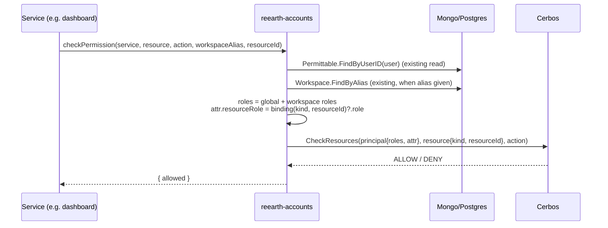
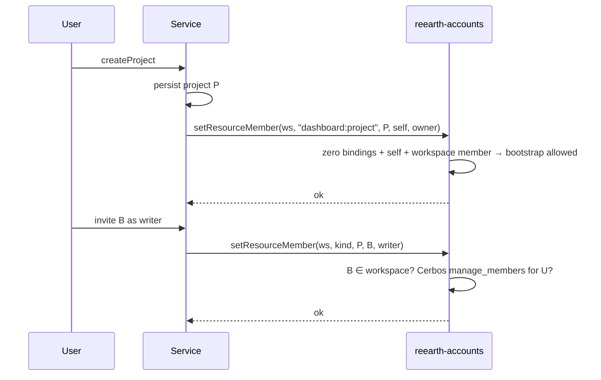
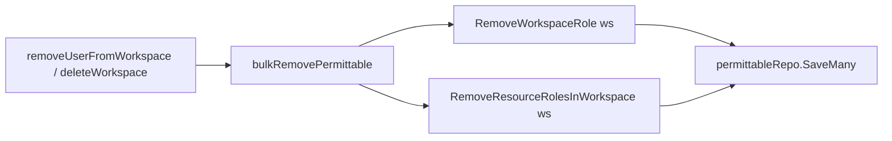

# Resource Role Binding (Generic Per-Resource Membership)

> **Status: DRAFT.** Adds a generic, opaque **"user × resource → role"** binding to
> `permittable`, so that consumer services (dashboard, visualizer, cms, …) can
> express per-resource membership such as *project members* **without
> reearth-accounts learning what a project is**. The first consumer is
> `dashboard:project`.

## Document Signature

|           |                |
|-----------|----------------|
| Creator   | soneda-yuya    |
| Leader    | TBD            |
| Task Link | TBD            |
| Developer | TBD            |

## Background / Problem Statement

### Current situation (fact)

- reearth-accounts is the authorization hub for the Re:Earth platform. A user's
  roles are stored on the `permittable.Permittable` aggregate
  (`server/pkg/permittable/permittable.go`):
  - `roleIDs` — global roles
  - `workspaceRoles` — `(workspaceID, roleID)` pairs, maintained by the
    `Workspace` interactor whenever membership changes
    (`updatePermittable` / `bulkRemovePermittable` in
    `server/internal/usecase/interactor/workspace.go`).
- `Query.checkPermission(service, resource, action, workspaceAlias)` builds a
  Cerbos principal from *global roles + the roles of that workspace* and checks
  resource kind `"<service>:<resource>"`
  (`server/internal/usecase/interactor/cerbos.go`). There is **no resource
  instance ID** in the input; the resource ID is synthesized from
  service/resource/workspaceAlias/userId.
- Resource kinds such as `dashboard:project` already exist as Cerbos policies,
  but accounts treats `"<service>:<resource>"` as an opaque string.

### Problem

Products need **project-level membership**: "user A is an editor of project P,
user B (same workspace) cannot see P". Today the finest granularity accounts
can express is the workspace.

If each service implements project membership on its own:

1. Invite / role-change / remove APIs and UI are duplicated per service.
2. Each service must react to **workspace membership changes** (user removed from
   workspace, workspace deleted) to clean up its project members. Only accounts
   owns that information, so every service needs an event/sync path, and a miss
   leaves a user with access to a project in a workspace they have left.
3. "A project member must be a member of the workspace" cannot be validated
   locally by the service without calling accounts anyway.
4. Authorization logic splits across N services instead of living in Cerbos
   policies evaluated through one entry point.

### Constraint (the reason for this design's shape)

Accounts must **not** absorb the *project* domain. Project existence, names,
visibility, content and lifecycle remain owned by each service. Accounts may
only own the *authorization* concept: "this principal holds this role on this
opaque resource".

## Goals

1. Accounts can store and evaluate a role binding for **any** resource instance,
   identified by an opaque `(resourceKind, resourceID)` pair.
2. `checkPermission` can evaluate a check against a specific resource instance
   and makes the caller's resource role available to Cerbos policies, with
   **zero additional DB reads** (the permittable is already loaded).
3. Workspace membership changes automatically cascade to resource bindings
   (removing a user from a workspace removes all of their bindings in it).
4. The words `project` / service-specific kinds never appear in accounts Go code
   or schema; adding a new resource kind (e.g. `cms:model`) requires **only a
   Cerbos policy**, no accounts code change.
5. Fully backward compatible: existing `checkPermission` calls and existing
   policies behave identically.

## Non-Goals

1. Storing any resource metadata (name, visibility, owner, timestamps) in accounts.
2. Validating that a resource exists. Accounts trusts the calling service.
3. Detecting resource deletion. The owning service is responsible for calling
   `removeResourceBindings` (see *Lifecycle*).
4. Resource hierarchies / inheritance (e.g. folder → project → layer). Can be
   layered later via policy; out of scope now.
5. Integration (M2M) members on resources. Only user principals in v1.
6. Passing arbitrary resource attributes (e.g. `visibility`) into
   `checkPermission`. Tracked as an Open Question; v1 policies use roles only.
7. Sending invite emails for resource membership. Emails carry resource
   names, which accounts does not have; the service sends them.

## Functional Requirements

1. `checkPermission` latency must not regress measurably: no extra repository
   call when `resourceId` is given (bindings are embedded in the already-loaded
   permittable).
2. Expected scale per user: ≤ ~1,000 bindings (well below the Mongo 16 MB
   document limit at ~150 B/binding). Per resource: ≤ ~1,000 members.
3. Listing members of one resource must be index-backed on both backends.
4. All mutations work on both MongoDB and PostgreSQL backends and in the
   `memory` repo.

## Solution Options

### Option 1 (Recommended): Embed `ResourceRoles` in `Permittable`

#### Domain

```go
// server/pkg/permittable/permittable.go
type Permittable struct {
    id             ID
    userID         user.ID
    roleIDs        []role.ID
    workspaceRoles []WorkspaceRole
    resourceRoles  []ResourceRole // NEW
    updatedAt      time.Time
}

// ResourceRole binds the user to a single resource instance owned by another
// service. Kind and ID are opaque to accounts.
type ResourceRole struct {
    workspaceID  workspace.ID // scope; used for cascades and the membership invariant
    resourceKind string       // "<service>:<resource>", e.g. "dashboard:project"
    resourceID   string       // the owning service's ID
    roleID       role.ID
}
```

Methods (mirroring the existing workspace-role API):

- `ResourceRoles() []ResourceRole`
- `ResourceRole(kind, id string) (ResourceRole, bool)`
- `SetResourceRole(r ResourceRole)` — upsert; **one role per (kind, id)**
- `RemoveResourceRole(kind, id string)`
- `RemoveResourceRolesInWorkspace(workspaceID)` — used by cascades

`resourceKind` is validated only syntactically (`^[a-z0-9-]+:[a-z0-9_-]+$`).
No `switch` on its value is permitted anywhere in accounts.

Roles reuse the existing `roles` table (`owner` / `maintainer` / `writer` /
`reader`). Their meaning per resource kind is defined solely by that kind's
Cerbos policy.

#### Storage

**MongoDB** — new optional array on the permittable document:

```json
"resource_roles": [
  { "workspace_id": "...", "resource_kind": "dashboard:project",
    "resource_id": "01j...", "role_id": "..." }
]
```

Indexes (added in the Mongo index setup alongside existing permittable indexes):

- `{ "resource_roles.resource_kind": 1, "resource_roles.resource_id": 1 }` — list members / bulk remove
- `{ "resource_roles.workspace_id": 1 }` — workspace cascades

**PostgreSQL** — new migration `0005_permittable_resource_roles.up.sql`:

```sql
CREATE TABLE permittable_resource_roles (
    permittable_id text NOT NULL REFERENCES permittables(id) ON DELETE CASCADE,
    workspace_id   text NOT NULL,
    resource_kind  text NOT NULL,
    resource_id    text NOT NULL,
    role_id        text NOT NULL,
    PRIMARY KEY (permittable_id, resource_kind, resource_id)
);
CREATE INDEX permittable_resource_roles_resource_idx
    ON permittable_resource_roles (resource_kind, resource_id);
CREATE INDEX permittable_resource_roles_workspace_idx
    ON permittable_resource_roles (workspace_id);
```

```sql
-- 0005_permittable_resource_roles.down.sql
DROP TABLE IF EXISTS permittable_resource_roles;
```

The sqlc schema mirror and queries are updated, then `make sqlc`. The permittable
Postgres repo loads/saves the child rows the same way it handles
`permittable_workspace_roles`.

Repository additions (`permittable.Repo`):

- `FindByResource(ctx, kind, id string) (List, error)`
- `RemoveResourceBindings(ctx, kind, id string) error` — bulk delete (Mongo
  `updateMany` + `$pull`; Postgres `DELETE ... WHERE resource_kind=$1 AND resource_id=$2`)

#### Authorization check

`CheckPermissionInput` gains one optional field:

```graphql
input CheckPermissionInput {
  service: String!
  resource: String!
  action: String!
  workspaceAlias: String
  resourceId: String   # NEW
}
```

In `Cerbos.CheckPermission`:

1. Principal **roles are unchanged** (global + workspace roles), so existing
   policies keep their exact semantics.
2. When `resourceId` is set:
   - the Cerbos resource ID becomes the real ID (`resourceId`) instead of the
     synthesized one;
   - the matching binding's role name, if any, is attached as a **principal
     attribute** `resourceRole` (empty string when the user has no binding).
3. Policies opt in via derived roles, keeping workspace roles and resource
   roles distinct:

```yaml
# dashboard policy (lives with the dashboard policies, not in accounts code)
apiVersion: api.cerbos.dev/v1
derivedRoles:
  name: resource_roles
  definitions:
    - name: resource_owner
      parentRoles: ["*"]
      condition: { match: { expr: P.attr.resourceRole == "owner" } }
    - name: resource_editor
      parentRoles: ["*"]
      condition: { match: { expr: P.attr.resourceRole in ["owner", "writer"] } }
    - name: resource_member
      parentRoles: ["*"]
      condition: { match: { expr: P.attr.resourceRole != "" } }
---
apiVersion: api.cerbos.dev/v1
resourcePolicy:
  version: default
  resource: dashboard:project
  importDerivedRoles: [resource_roles]
  rules:
    - actions: [read]
      effect: EFFECT_ALLOW
      derivedRoles: [resource_member]
    - actions: [read, edit, manage_members]
      effect: EFFECT_ALLOW
      roles: [owner, maintainer]          # workspace admins keep full access
    - actions: [edit]
      effect: EFFECT_ALLOW
      derivedRoles: [resource_editor]
    - actions: [manage_members]
      effect: EFFECT_ALLOW
      derivedRoles: [resource_owner]
```

Whether workspace roles *add to* or are *restricted by* project membership is
therefore a per-product policy decision, not an accounts decision.

#### Membership management API

```graphql
input SetResourceMemberInput {
  workspaceId: ID!
  resourceKind: String!   # "<service>:<resource>"
  resourceId: String!
  userId: ID!
  role: Role!
}
input RemoveResourceMemberInput {
  resourceKind: String!
  resourceId: String!
  userId: ID!
}
input RemoveResourceBindingsInput {
  resourceKind: String!
  resourceId: String!
}

type ResourceMember { userId: ID!, role: Role! }
type ResourceBinding { workspaceId: ID!, resourceKind: String!, resourceId: String!, role: Role! }

extend type Query {
  resourceMembers(resourceKind: String!, resourceId: String!): [ResourceMember!]!
  # IDs only; the owning service hydrates names etc.
  myResourceBindings(resourceKind: String!, workspaceId: ID): [ResourceBinding!]!
}

extend type Mutation {
  setResourceMember(input: SetResourceMemberInput!): ResourceMember
  removeResourceMember(input: RemoveResourceMemberInput!): Boolean!
  removeResourceBindings(input: RemoveResourceBindingsInput!): Boolean!
}
```

Generic guard applied by a new `ResourceRole` interactor (no kind-specific code):

| Mutation | Guard |
|---|---|
| `setResourceMember` | (a) target user is a member of `workspaceId`; (b) existing bindings for the resource, if any, share that `workspaceId`; (c) Cerbos allows `manage_members` on `(resourceKind, resourceId)` for the operator — **or** the bootstrap rule below |
| `removeResourceMember` | Cerbos `manage_members`, or operator == target user (self-leave) |
| `removeResourceBindings` | Cerbos `delete` on `(resourceKind, resourceId)` |
| `resourceMembers` | Cerbos `read` on `(resourceKind, resourceId)` |
| `myResourceBindings` | operator's own bindings only |

**Bootstrap rule:** when a resource has **zero** bindings, the operator may grant
**themselves** `owner`, provided they are a member of `workspaceId`. This lets a
service register the creator immediately after creating a resource without
special service credentials. Accounts can evaluate this generically because it
owns the binding data.

**Last-owner rule:** removing or downgrading the last `owner` binding of a
resource is rejected (mirrors the workspace sole-owner protection), except via
`removeResourceBindings`.

#### Lifecycle and cascades

| Event | Who acts | Effect on bindings |
|---|---|---|
| Resource created | Service | Calls `setResourceMember(self, owner)` (bootstrap rule) |
| Resource deleted | Service | Calls `removeResourceBindings`. A missed call leaves only dangling bindings to a non-existent resource — harmless for authorization, cleaned by an optional sweeper later |
| User removed from workspace | Accounts | `bulkRemovePermittable` also calls `RemoveResourceRolesInWorkspace` |
| Workspace deleted (`Workspace.Remove`) | Accounts | Same path via `bulkRemovePermittable` |
| Workspace deactivated / restored | Accounts | No change (mirrors workspace roles; data kept for restore) |
| User deleted (`DeleteMe`) | Accounts | Today `DeleteMe` does not delete the permittable. Bindings are unreachable once the user is gone; deleting the permittable on `DeleteMe` is proposed as a follow-up fix (independent of this feature) |

**Pros**

- Zero extra reads on `checkPermission`; same aggregate, same transactional
  boundary as workspace roles, so cascades are a few lines in existing code.
- Accounts remains domain-agnostic: opaque kind/ID, semantics in policies.
- Adding a new resource kind = adding a policy file.

**Cons**

- Permittable documents grow with the number of bindings (bounded, see FR-2).
- "List members of a resource" queries go through a multikey index (Mongo)
  rather than a dedicated collection.
- Services must remember to call `removeResourceBindings` on delete.

### Option 2: Separate `resource_binding` aggregate / collection

Same API and policies, but bindings live in their own collection/table keyed by
`(resourceKind, resourceID, userID)`.

**Pros:** no document growth on permittable; member listing is a plain index scan.

**Cons:** `checkPermission` needs an extra repository read per resource check;
cascades from workspace membership change must update two aggregates (more
code paths in the transaction); diverges from the existing `workspaceRoles`
pattern.

**Decision:** Option 1. Revisit Option 2 if per-user binding counts approach
the FR-2 bound.

### Alternative considered and rejected: membership in each service

Rejected because of the duplication and cascade problems in *Problem* (1)–(4).
The variant "services keep members but pass the role to Cerbos as an attribute"
solves only (4).

## Design

### Permission check with a resource ID



### Project creation and member invite



### Workspace member removal cascade



## Potential Impact

1. **Permittable document/row size** grows by ~150 B per binding.
2. **Cerbos resource ID change** when `resourceId` is passed: policies or audit
   logs that pattern-match the synthesized ID are affected only for callers that
   opt in by sending `resourceId`.
3. **Workspace member removal** does slightly more work (in-memory filter on the
   already-loaded permittable; no extra query).
4. **Policy authoring**: role names are shared between workspace and resource
   scopes; using the `resourceRole` attribute (not principal roles) prevents a
   project `owner` from being mistaken for a workspace `owner`.
5. **gqlclient** (`server/pkg/gqlclient`) consumers need a version bump to use
   the new fields; old clients are unaffected.

## Test Plan

1. **Unit** (`pkg/permittable`): set/upsert/remove resource role,
   one-role-per-resource invariant, `RemoveResourceRolesInWorkspace`, kind syntax
   validation.
2. **Interactor** (`internal/usecase/interactor`):
   - `CheckPermission` with/without `resourceId`; `resourceRole` attribute
     populated/empty; roles list unchanged (regression).
   - `setResourceMember`: non-workspace-member rejected; workspace mismatch
     rejected; bootstrap allowed only with zero bindings + self + owner; denied
     without `manage_members`.
   - Last-owner protection.
   - `RemoveUserMember` / `RemoveMultipleUserMembers` / `Remove` cascade bindings.
3. **Repository**: Mongo, Postgres and memory implementations of
   `FindByResource` / `RemoveResourceBindings` and round-trip of
   `resource_roles` (`make test-integration`).
4. **Migration**: `0005` up/down on an existing DB; existing permittables load
   with empty `resourceRoles`.
5. **E2E** (`server/e2e`): add a `dashboard:project` test policy using the
   derived roles above; verify member / non-member / workspace-owner outcomes.

## Deployment Plan

1. Backward compatible? **Yes.** New optional input field, new optional document
   field, new table, new queries/mutations. Existing behavior is unchanged when
   `resourceId` is absent.
2. Partial deployment? **Yes.** Deploy accounts first; services opt in later.
   Policies using `P.attr.resourceRole` must be deployed **after** accounts
   (before that the attribute is absent and derived roles simply never match —
   fail-closed).
3. Notify: dashboard / visualizer / cms owners; whoever maintains Cerbos policies.
4. Config changes: none.
5. DDL: Postgres migration `0005` runs automatically at startup (golang-migrate).
   Mongo: index creation at startup; no backfill needed.

## Rollback Plan

1. Notify the cause in the team Slack channel.
2. Revert consumer services / policies that rely on `resourceRole` first.
3. Roll back the accounts image. The old binary ignores `resource_roles` in Mongo
   and the extra Postgres table, so **no data rollback is required**.
4. Only if the schema itself must be removed: run `0005` down (drops bindings —
   take a dump first).

## Post Deployment

- Checklist
  - Create a project in dashboard staging; verify creator gets `owner` binding.
  - Invite a workspace member; verify access. Remove them from the workspace;
    verify project access is lost.
- Metrics
  - `checkPermission` p50/p95 latency before vs after (expect no change).
  - Error rate of `setResourceMember` / `removeResourceBindings`.
  - Count of bindings per permittable (max / p99) to watch FR-2.
- Alerting
  - `checkPermission` error rate: Warning > 1%, Danger ≥ 5%.
  - `checkPermission` p95 latency: Warning > +20% vs baseline.

## Open Questions

1. **Resource attributes in `checkPermission`.** Rules like "private projects are
   visible only to members, public ones to the whole workspace" need the
   resource's `visibility`. Proposal: optional `attributes: JSON` on
   `CheckPermissionInput`, passed through to the Cerbos resource. Deferred until
   a product needs it.
2. **Batch checks** (`checkPermissions` over many `resourceId`s) for list
   screens. Cerbos `CheckResources` already supports it; needed when a service
   filters a project list by membership.
3. **Dangling-binding sweeper** for resources deleted without
   `removeResourceBindings`: worth it, or rely on service discipline?
4. **Integration members** on resources (M2M tokens) — needed by cms?

## Reviewed by

- Technical Architect: [name]
- Technical Leader: [name]
- Peers: [name]
