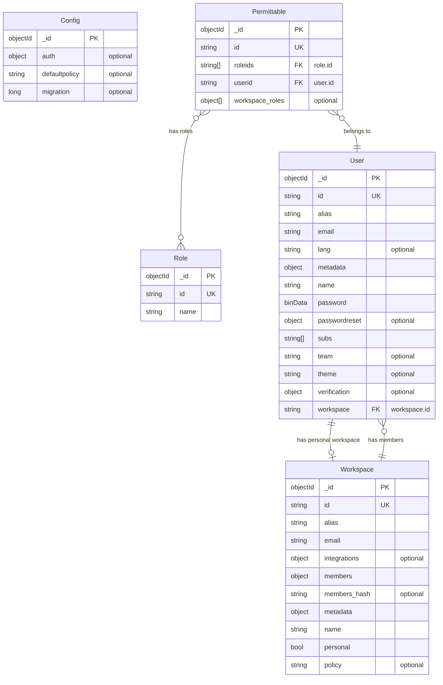

# Entity Relationship Diagram

<!-- This file is auto-generated by tools/cmd/ergen. Do not edit manually. -->

## Relationships

| From | To | Type | Description |
|------|-----|------|-------------|
| User | Workspace | 1:1 | Each user has a personal workspace (`user.workspace` → `workspace.id`) |
| Workspace | User | 1:N | Workspace has multiple members (`workspace.members[userId]`) |
| Permittable | User | N:1 | Permittable belongs to a user (`permittable.userid` → `user.id`) |
| Permittable | Role | N:M | Permittable has multiple roles (`permittable.roleids[]` → `role.id`) |
